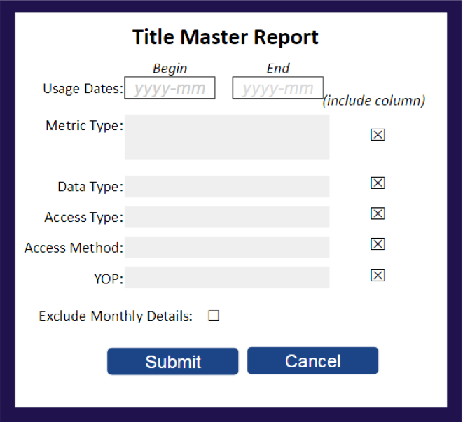

.. The COUNTER Code of Practice Release 5 © 2017-2023 by COUNTER
   is licensed under CC BY-SA 4.0. To view a copy of this license,
   visit https://creativecommons.org/licenses/by-sa/4.0/

.. _reports-for-consumers:

COUNTER Reports for Report Consumers
------------------------------------

Reports for R5 consist of four COUNTER Reports that allow the report consumer to filter and configure to create customized views of their usage data. R5 also specifies Standard Views of the COUNTER Reports (pre-set filters/configuration).

To achieve compliance, a report provider MUST offer the COUNTER Reports and Standard Views of the COUNTER Reports that are applicable to their Host_Types, with the exception of Standard Views that always would be empty (e.g. an Access Denied Standard View if denials cannot occur). An independent audit is required for these reports.

Report providers may offer additional COUNTER Reports and Standard Views of the COUNTER Reports not required for compliance or custom reports (see :numref:`custom-reports`), according to the rules set for the reports by the Code of Practice. For these reports an audit isn’t required.

COUNTER Reports
"""""""""""""""

COUNTER Reports include all relevant metrics and attributes; they are intended to be customizable through the application of filters and other configuration options, allowing report consumers to create a report specific to their needs. The four COUNTER Reports are shown in Table 3.a along with their Report_ID, Report_Name and Host_Types who are REQUIRED to provide these reports. See :numref:`host-types` below for details on Host_Types.

Table 3.a (below): COUNTER Reports

.. only:: latex

   .. tabularcolumns:: |>{\raggedright\arraybackslash}\Y{0.13}|>{\raggedright\arraybackslash}\Y{0.17}|>{\parskip=\tparskip}\Y{0.37}|>{\raggedright\arraybackslash}\Y{0.33}|

.. list-table::
   :class: longtable
   :widths: 10 18 48 24
   :header-rows: 1

   * - Report_ID
     - Report_Name
     - Details
     - Host_Types

   * - PR
     - Platform Report
     - A customizable report summarizing activity across a report provider’s platforms that allows the user to apply filters and select other configuration options.
     - All Host_Types

   * - DR
     - Database Report
     - A customizable report detailing activity by database that allows the user to apply filters and select other configuration options.
     - A&I_Database\ |br|\ |lb|
       Aggregated_Full_Content\ |br|\ |lb|
       Discovery_Service\ |br|\ |lb|
       eBook_Collection\ |br|\ |lb|
       Full_Content_Database\ |br|\ |lb|
       Multimedia_Collection

   * - TR
     - Title Report
     - A customizable report detailing activity at the title level (journal, book, etc.) that allows the user to apply filters and select other configuration options.
     - Aggregated_Full_Content\ |br|\ |lb|
       eBook\ |br|\ |lb|
       eBook_Collection\ |br|\ |lb|
       eJournal

   * - IR
     - Item Report
     - A granular, customizable report showing activity at the level of the item (article, chapter, media object, etc.) that allows the user to apply filters and select other configuration options.
     - Data_Repository*\ |br|\ |lb|
       Multimedia\ |br|\ |lb|
       Repository\ |br|\ |lb|
       Scholarly_Collaboration_Network

\* Data repositories may choose to conform to the Code of Practice Release 5 or, alternatively, may wish to work with the Code of Practice for Research Data.

Figure 3.a (below) provides an example of how the user interface could look. The user will be presented with an interface that allows them to select usage dates, one or more Metric_Types, Data_Types, Access_Types, etc. and indicate if the filter columns are to be included. Including the column will cause usage to be broken out by individual values for the selected filter, whereas not including the column will result in usage being summarized for the selected filter.

.. centered:: Figure 3.a: Example of a user interface

Reporting for Open Access
'''''''''''''''''''''''''

All Host_Types are encourged but not required to provide a Global Item Report, which provides a granular per-item view of all usage, whether attributed to institutions or not.

The Global Item Report is an Item Report to "The World" including all global usage, whether attributed to an institution or not, which could be broked down by geolocation with the Country and Subdivision extensions.

Standard Views of the COUNTER Reports
"""""""""""""""""""""""""""""""""""""

The goal of Standard Views of the COUNTER Reports is to provide a set of pre-filtered views of the COUNTER Reports covering the most common set of report consumer needs. Report_IDs for Standard Views are derived from the Report_ID of the COUNTER Report that they are based on. The format is *{COUNTER Report_ID}*\ _\ *{View ID}*.

Standard Views of the Platform Report
'''''''''''''''''''''''''''''''''''''

The Platform Usage Standard View is derived from the Platform Report and provides a summary of activity on a given platform to support the evaluation of platforms and to provide high-level statistical data to support surveys and reporting to funders.

Table 3.b (below): Platform Usage Standard View

.. only:: latex

   .. tabularcolumns:: |>{\raggedright\arraybackslash}\Y{0.13}|>{\raggedright\arraybackslash}\Y{0.17}|>{\parskip=\tparskip}\Y{0.37}|>{\raggedright\arraybackslash}\Y{0.33}|

.. list-table::
   :class: longtable
   :widths: 10 18 48 24
   :header-rows: 1

   * - Report_ID
     - Report_Name
     - Details
     - Host_Types

   * - PR_P1
     - Platform Usage
     - Platform-level usage summarized by Metric_Type.
     - All Host_Types

\*Data repositories may choose to conform to the Code of Practice Release 5 or, alternatively, may wish to work with the Code of Practice for Research Data.

See :numref:`platform-reports` below for details on Platform Usage Reports.

Standard Views of the Database Report
'''''''''''''''''''''''''''''''''''''

The Standard Views of the Database Report support the evaluation of the value of a given database of resources (e.g. a full-text database, an A&I database, or a multimedia collection).

Table 3.c (below): Standard Views of the Database Report

.. only:: latex

   .. tabularcolumns:: |>{\raggedright\arraybackslash}\Y{0.13}|>{\raggedright\arraybackslash}\Y{0.18}|>{\parskip=\tparskip}\Y{0.44}|>{\raggedright\arraybackslash}\Y{0.25}|

.. list-table::
   :class: longtable
   :widths: 10 18 54 18
   :header-rows: 1

   * - Report_ID
     - Report_Name
     - Details
     - Host_Types

   * - DR_D1
     - Database Search and Item Usage
     - Reports on key Searches, Investigations and Requests metrics needed to evaluate a database.
     - A&I_Database\ |br|\ |lb|
       Aggregated_Full_Content\ |br|\ |lb|
       Discovery_Service\ |br|\ |lb|
       eBook_Collection\ |br|\ |lb|
       Full_Content_Database\ |br|\ |lb|
       Multimedia_Collection

   * - DR_D2
     - Database Access Denied
     - Reports on Access Denied activity for databases where users were denied access because simultaneous-use licenses were exceeded or their institution did not have a license for the database.
     - A&I_Database\ |br|\ |lb|
       Aggregated_Full_Content\ |br|\ |lb|
       Discovery_Service\ |br|\ |lb|
       eBook_Collection\ |br|\ |lb|
       Full_Content_Database\ |br|\ |lb|
       Multimedia_Collection

See :numref:`database-reports` below for details on Database Usage Reports.

Standard Views of the Title Report
'''''''''''''''''''''''''''''''''''

Standard Views of the Title Report are used to support the evaluation of the value of a given serial (e.g. journal, magazine, or newspaper) or monograph (e.g. book, eBook, textbook, or reference work) title.

Table 3.d (below): Standard Views of the Title Report

.. only:: latex

   .. tabularcolumns:: |>{\raggedright\arraybackslash}\Y{0.13}|>{\raggedright\arraybackslash}\Y{0.19}|>{\parskip=\tparskip}\Y{0.43}|>{\raggedright\arraybackslash}\Y{0.25}|

.. list-table::
   :class: longtable
   :widths: 10 18 54 18
   :header-rows: 1

   * - Report_ID
     - Report_Name
     - Details
     - Host_Types

   * - TR_B1
     - Book Requests (Controlled)
     - Reports on full-text activity for books, excluding Open and Free_To_Read content, as Total_Item_Requests and Unique_Title_Requests. The Unique_Title_Requests provides comparable usage across book platforms. The Total_Item_Requests show usage per item, so usage on different platforms will vary based on how the content is delivered (e.g. delivered as a complete book or by chapter).
     - Aggregated_Full_Content\ |br|\ |lb|
       eBook\ |br|\ |lb|
       eBook_Collection

   * - TR_B2
     - Book Access Denied
     - Reports on Access Denied activity for books where users were denied access because simultaneous-use licenses were exceeded or their institution did not have a license for the book.
     - Aggregated_Full_Content\ |br|\ |lb|
       eBook\ |br|\ |lb|
       eBook_Collection

   * - TR_B3
     - Book Usage by Access Type
     - Reports on book usage showing all applicable Metric_Types broken down by Access_Type.
     - Aggregated_Full_Content\ |br|\ |lb|
       eBook\ |br|\ |lb|
       eBook_Collection

   * - TR_J1
     - Journal Requests (Controlled)
     - Reports on usage of journal content, excluding Open and Free_To_Read content, as Total_Item_Requests and Unique_Item_Requests. The Unique_Item_Requests provides comparable usage across journal platforms by reducing the inflationary effect that occurs when an HTML full text automatically displays and the user then accesses the PDF version. The Total_Item_Requests shows overall activity.
     - Aggregated_Full_Content\ |br|\ |lb|
       eJournal

   * - TR_J2
     - Journal Access Denied
     - Reports on Access Denied activity for journal content where users were denied access because simultaneous-use licenses were exceeded or their institution did not have a license for the title.
     - Aggregated_Full_Content\ |br|\ |lb|
       eJournal

   * - TR_J3
     - Journal Usage by Access Type
     - Reports on usage of journal content for all Metric_Types broken down by Access_Type.
     - Aggregated_Full_Content\ |br|\ |lb|
       eJournal

   * - TR_J4
     - Journal Requests by YOP (Controlled)
     - Breaks down the usage of journal content, excluding Open and Free_To_Read content, by year of publication (YOP), providing counts for the Metric_Types Total_Item_Requests and Unique_Item_Requests. Provides the details necessary to analyze usage of content in backfiles or covered by perpetual access agreements. Note that COUNTER reports do not provide access model or perpetual access rights details.
     - Aggregated_Full_Content\ |br|\ |lb|
       eJournal

See :numref:`title-reports` below for details on Title Usage Standard Views.

Standard Views of the Item Report
'''''''''''''''''''''''''''''''''

The Standard Views for item-level reporting are designed to support the most common reporting needs. The Standard View for repositories (Journal Article Requests) provides insight into the usage of individual journal articles. The Standard View for multimedia (Multimedia Item Requests) allows evaluation of multimedia at the title level.

Table 3.e (below): Standard Views of the Item Report

.. only:: latex

   .. tabularcolumns:: |>{\raggedright\arraybackslash}\Y{0.13}|>{\raggedright\arraybackslash}\Y{0.17}|>{\parskip=\tparskip}\Y{0.37}|>{\raggedright\arraybackslash}\Y{0.33}|

.. list-table::
   :class: longtable
   :widths: 10 18 48 24
   :header-rows: 1

   * - Report_ID
     - Report_Name
     - Details
     - Host_Types

   * - IR_A1
     - Journal Article Requests
     - Reports on journal article requests at the article level. This report is limited to content with a Data_Type of Article, Parent_Data_Type of Journal, and Metric_Types of Total_Item_Requests and Unique_Item_Requests.

       This Standard View must be provided only if (a) it is clear for all articles in IR whether they are journal articles or not and (b) the parent item is known for all journal articles.
     - Repository\ |br|\ |lb|
       Scholarly_Collaboration_Network

   * - IR_M1
     - Multimedia Item Requests
     - Reports on multimedia requests at the item level.
     - Multimedia

See :numref:`item-reports` below for details on Item Usage Reports.
