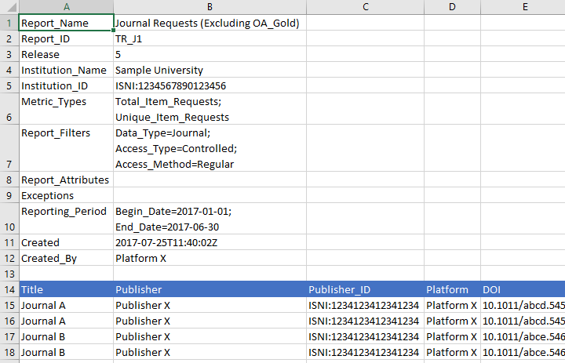
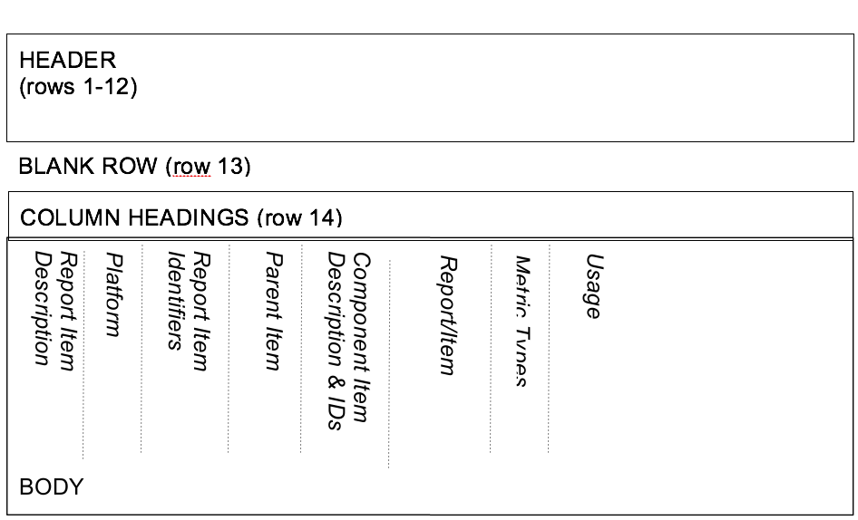
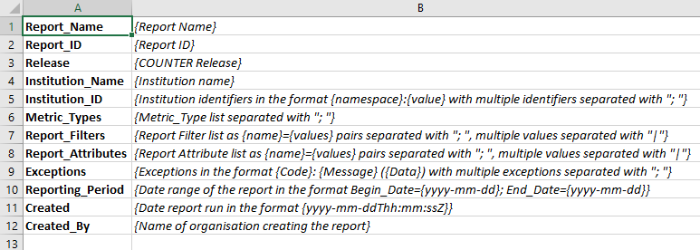

.. The COUNTER Code of Practice Release 5 © 2017-2021 by COUNTER
   is licensed under CC BY-SA 4.0. To view a copy of this license,
   visit https://creativecommons.org/licenses/by-sa/4.0/

.. _formats:

Formats for COUNTER Reports
---------------------------

R5 reports can be delivered in tabular form, or as machine-readable data (JSON) via the COUNTER_SUSHI API. The tabular form MUST be provided as either an Excel or a tab-separated-value (TSV) file, or both. Additional file formats that can be easily imported into spreadsheet programs without loss or corruption may be offered at the vendor's discretion. The reports in JSON, TSV and other text formats MUST be encoded using UTF-8. The JSON format MUST comply with the COUNTER_SUSHI API Specification (see :numref:`sushi` below).

All COUNTER reports have the same layout and structure. Figure 3.b (below) provides an example of the “Journal Requests (Excluding OA_Gold)” Standard View. Figure 3.c (below) shows the layout for tabular reports, which will be the focus of the discussions throughout this document. Note that the COUNTER_SUSHI API Specification includes the same elements with the same or similar names; therefore, understanding the tabular reports translates to an understanding of what is REQUIRED in reports retrieved via the COUNTER_SUSHI API.

.. centered:: Figure 3.b: Sample “Journal Requests (Excluding OA_Gold)” Standard View

.. centered:: Figure 3.c: Layout for tabular COUNTER reports

All COUNTER reports have a header. In tabular reports, the header is separated from the body with a blank row (to facilitate sorting and filtering in Excel). Beneath that is the body of the report with column headings. The contents of the body will vary by report. Figure 3.c (above) identifies the different kinds of information you may find in the report and the relative positioning of this information. All of this is discussed in more detail below.

.. _report-header:

Report Header
"""""""""""""

The first 12 rows of a tabular COUNTER report contain the header, and the 13th row is always blank. The header information is presented as a series of name-value pairs, with the names appearing in Column A and the corresponding values appearing in Column B. All tabular COUNTER reports have the same names in Column A. Column B entries will vary by report.

.. centered:: Figure 3.d: Common Report Header Information

Figure 3.d (above) shows the layout of the common header. The 12 elements in Column A and the values in Column B are discussed in more detail in the table below. Note that the element names (Column A) MUST appear in the COUNTER report exactly as they are shown here. Capitalization, spelling, and punctuation MUST match exactly.

Table 3.f (below): COUNTER Report Header Elements

.. only:: latex

   .. tabularcolumns:: |>{\raggedright\arraybackslash}\Y{0.19}|>{\parskip=\tparskip}\Y{0.48}|>{\raggedright\arraybackslash}\Y{0.33}|

.. list-table::
   :class: longtable
   :widths: 14 57 29
   :header-rows: 1

   * - Element Name
     - Description of value to provide
     - Example

   * - Report_Name
     - The name of the report as it appears in :numref:`reports-for-libraries`.
     - Journal Requests (Excluding OA_Gold)

   * - Report_ID
     - The unique identifier for the report as it appears in :numref:`reports-for-libraries`.
     - TR_J1

   * - Release
     - The COUNTER release this report complies with.
     - 5

   * - Institution_Name
     - For subscription-based services, the name of the institution to which the usage is attributed. For OA publishers and repositories, where it is not possible to identify usage by individual institutions, the usage should be attributed to “The World”.
     - Mt. Laurel University

   * - Institution_ID
     - A series of identifiers that represent the institution in the format of *{namespace}*:*{value}*. Include multiple identifiers by separating with a semicolon-space (“; ”). Permitted identifier namespaces are ISIL, ISNI, OCLC and, for local identifiers assigned by the content provider, the platform ID of the content provider.
     - ISNI:0000000419369078; pubsiteA:PrncU

   * - Metric_Types
     - A semicolon-space delimited list of Metric_Types requested for this report. Note that even though a Metric_Type was requested, it might not be included in the body of the report if no report items had usage of that type.
     - Unique_Item_Investigations; Unique_Item_Requests

   * - Report_Filters
     - A series of zero or more report filters applied on the reported usage, excluding Metric_Type, Begin_Date and End_Date (which appear in separate rows in the tabular reports for easier reading). Typically, a report filter affects the amount of usage reported. Entries appear in the form of *{filter name}*\ =\ *{filter value}* with multiple filter name-value pairs separated with a semicolon-space (“; ”) and multiple filter values for a single filter name separated by the vertical pipe (“|”) character.
     - Access_Type=Controlled; Access_Method=Regular

   * - Report_Attributes
     - A series of zero or more report attributes applied to the report. Typically, a report attribute affects how the usage is presented but does not change the totals.

       Entries appear in the form of *{attribute name}*\ =\ *{attribute value}* with multiple attribute name-value pairs separated with a semicolon-space (“; ”) and multiple attribute values for a single attribute name separated by the vertical pipe (“|”) character.
     - Attributes_To_Show=Access_Type

   * - Exceptions
     - An indication of some difference between the usage that was requested and the usage that is being presented in the report. The format for the exception values is “*{Exception Number}*:*{Exception Description}* (*{Data}*)” with multiple exception values separated by semicolon-space (“; ”). The Exception Number and Exception Description MUST match values provided in Table F.1 of :ref:`Appendix F <appendix-f>`. The Data is OPTIONAL.

       Note that for tabular reports, only the limited set of exceptions where usage is returned will apply.
     - 3031: Usage Not Ready for Requested Dates (request was for 2016-01-01 to 2016-12-31; however, usage is only available to 2016-08-31)

   * - Reporting_Period
     - The date range for the usage represented in the report, in the form of: “Begin_Date=\ *yyyy-mm-dd*; End_Date=\ *yyyy-mm-dd*”.
     - Begin_Date=2016-01-01; End_Date=2016-08-30

   * - Created
     - The date and time the usage was prepared, in RFC3339 date-time format (*yyyy-mm-ddThh:mm:ssZ*).
     - 2016-10-11T14:37:15Z

   * - Created_By
     - The name of the organization or system that created the COUNTER report.
     - EBSCO Information Services\ |br|\ |lb|
       360 COUNTER

   * - (blank row)
     - Row 13 MUST be blank.
     -

Report Body
"""""""""""

Figures 3.b and 3.c (above) show the body of the COUNTER reports containing an extensive array of data elements. Not all reports will include all elements. When formatting a report, maintain the order of elements described below, but only include those elements relevant to that report. Where practical, the discussion below will provide guidance as to which reports an element may be included in. See :numref:`reports` below for an extensive mapping of elements to reports.

.. rubric:: Report Item Description

Every COUNTER report will have columns that describe its report items.

Table 3.g (below): Elements that Describe the Report Item

.. only:: latex

   .. tabularcolumns:: |>{\raggedright\arraybackslash}\Y{0.16}|>{\parskip=\tparskip}\Y{0.42}|>{\raggedright\arraybackslash}\Y{0.17}|>{\raggedright\arraybackslash}\Y{0.25}|

.. list-table::
   :class: longtable
   :widths: 13 54 13 20
   :header-rows: 1

   * - Element Name
     - Description
     - Reports
     - Examples

   * - Database
     - Name of database for which usage is being reported. Applies only to Database Reports.
     - DR\ |br|\ |lb|
       DR_D1, DR_D2
     - MEDLINE

   * - Title
     - Name of the book or journal for which usage is being reported. Applies only to Title Reports.
     - TR\ |br|\ |lb|
       TR_B1, TR_B2, TR_B3, TR_J1, TR_J2, TR_J3, TR_J4
     - Journal of Economics\ |br|\ |lb|
       Gone with the Wind

   * - Item
     - Name of the article, book chapter, multimedia work, or repository item for which usage is being reported. Applies only to Item Reports.
     - IR\ |br|\ |lb|
       IR_A1, IR_M1
     - CRISPR gene-editing tested in a person for the first time

   * - Publisher
     - Name of the publisher of the content item. Note that when the content item is a database, the publisher would be the organization that creates that database.
     - DR, TR, IR\ |br|\ |lb|
       DR_D1, DR_D2, TR_B1, TR_B2, TR_B3, TR_J1, TR_J2, TR_J3, TR_J4, IR_A1, IR_M1
     - Taylor & Francis\ |br|\ |lb|
       APA

   * - Publisher_ID
     - A unique identifier for the publisher in the form of *{namespace}*:*{value}*. When multiple identifiers are available for a given publisher, include all identifiers separated with semicolon-space (“; ”), but only one per type. Permitted identifier namespaces are ISNI and, for local identifiers assigned by the content provider, the platform ID of the content provider.
     - DR, TR, IR\ |br|\ |lb|
       DR_D1, DR_D2, TR_B1, TR_B2, TR_B3, TR_J1, TR_J2, TR_J3, TR_J4, IR_A1, IR_M1
     - ISNI:1234123412341234\ |br|\ |lb|
       ebscohost:PubX

.. rubric:: Platform

The next column in the report identifies the platform where the activity happened.

Table 3.h (below): Elements that Identify the Platform

.. only:: latex

   .. tabularcolumns:: |>{\raggedright\arraybackslash}\Y{0.16}|>{\parskip=\tparskip}\Y{0.51}|>{\raggedright\arraybackslash}\Y{0.17}|>{\raggedright\arraybackslash}\Y{0.16}|

.. list-table::
   :class: longtable
   :widths: 13 62 13 12
   :header-rows: 1

   * - Element Name
     - Description
     - Reports
     - Examples

   * - Platform
     - Identifies the platform/content host where the activity took place. Note that in cases where individual titles or groups of content have their own branded user experience but reside on a common host, the identity of the underlying common host MUST be used as the Platform.
     - All reports:\ |br|\ |lb|
       PR, DR, TR, IR\ |br|\ |lb|
       PR_P1, DR_D1, DR_D2, TR_B1, TR_B2, TR_B3, TR_J1, TR_J2, TR_J3, TR_J4, IR_A1, IR_M1
     - EBSCOhost\ |br|\ |lb|
       ProQuest\ |br|\ |lb|
       ScienceDirect

.. rubric:: Report Item Identifiers

The item being reported on is further identified by the columns to the right of the platform.

Table 3.i (below): Elements for Report Item Identifiers

.. only:: latex

   .. tabularcolumns:: |>{\raggedright\arraybackslash}\Y{0.18}|>{\parskip=\tparskip}\Y{0.41}|>{\raggedright\arraybackslash}\Y{0.17}|>{\raggedright\arraybackslash}\Y{0.24}|

.. list-table::
   :class: longtable
   :widths: 14 53 13 20
   :header-rows: 1

   * - Element Name
     - Description
     - Reports
     - Examples

   * - Authors
     - Authors of the work for which usage is being reported in the format *{author name}* (*{author identifier}*) with author identifier in the format *{namespace}*:*{value}*. Permitted identifier namespaces are ISNI and ORCID. A maximum of three authors should be included with multiple authors separated by semicolon-space (“; ”).

       Note that this element is only used in tabular reports, in JSON reports authors are represented as Item_Contributors with Type Author.
     - IR\ |br|\ |lb|
       IR_A1
     - John Smith (ORCID:0000-0001-2345-6789)

   * - Publication_Date
     - Date of publication for the work in the format *yyyy-mm-dd*.
     - IR\ |br|\ |lb|
       IR_A1
     - 2018-09-05

   * - Article_Version
     - ALPSP/NISO code indicating the version of the work. Possible values are the codes for Accepted Manuscript, Version of Record, Corrected Version of Record, and Enhanced Version of Record.
     - IR\ |br|\ |lb|
       IR_A1
     - VoR

   * - DOI
     - Digital Object Identifier for the item being reported on in the format *{DOI prefix}*/*{DOI suffix}*.
     - TR, IR\ |br|\ |lb|
       TR_B1, TR_B2, TR_B3, TR_J1, TR_J2, TR_J3, TR_J4, IR_A1, IR_M1
     - 10.1629/uksg.434

   * - Proprietary_ID
     - A proprietary ID assigned by the content provider for the item being reported on. Format as *{namespace}*:*{value}* where the namespace is the platform ID of the host which assigned the proprietary identifier.
     - DR, TR, IR\ |br|\ |lb|
       DR_D1, DR_D2, TR_B1, TR_B2, TR_B3, TR_J1, TR_J2, TR_J3, TR_J4, IR_A1, IR_M1
     - publisherA:jnrlCode123

   * - ISBN
     - International Standard Book Number in the format ISBN-13 with hyphens.
     - TR, IR\ |br|\ |lb|
       TR_B1, TR_B2, TR_B3
     - 978-3-16-148410-0

   * - Print_ISSN
     - International Standard Serial Number assigned to the print instance of a serial publication in the format *nnnn-nnn[nX]*.
     - TR, IR\ |br|\ |lb|
       TR_B1, TR_B2, TR_B3, TR_J1, TR_J2, TR_J3, TR_J4, IR_A1
     - 0953-1513

   * - Online_ISSN
     - International Standard Serial Number assigned to the online instance of a serial publication in the format *nnnn-nnn[nX]*.
     - TR, IR\ |br|\ |lb|
       TR_B1, TR_B2, TR_B3, TR_J1, TR_J2, TR_J3, TR_J4, IR_A1
     - 2048-7754

   * - Linking_ISSN
     - International Standard Serial Number that links together the ISSNs assigned to all instances of a serial publication in the format *nnnn-nnn[nX]* (JSON reports only).
     - TR, IR\ |br|\ |lb|
       TR_B1, TR_B2, TR_B3, TR_J1, TR_J2, TR_J3, TR_J4, IR_A1
     - 0953-1513

   * - URI
     - Universal Resource Identifier, a valid URL or URN according to RFC 3986.
     - TR, IR\ |br|\ |lb|
       TR_B1, TR_B2, TR_B3, TR_J1, TR_J2, TR_J3, TR_J4, IR_A1, IR_M1
     -

.. rubric:: Parent Item Description and Identifiers

When reporting usage on content items like articles and book chapters, it is often desirable to identify the item’s parent item, such as the journal or book it is part of. This next grouping of columns identifies the parents and is used by a small subset of reports.

Table 3.j (below): Elements that Describe a Parent Item

.. only:: latex

   .. tabularcolumns:: |>{\raggedright\arraybackslash}\Y{0.25}|>{\parskip=\tparskip}\Y{0.42}|>{\raggedright\arraybackslash}\Y{0.11}|>{\raggedright\arraybackslash}\Y{0.22}|

.. list-table::
   :class: longtable
   :widths: 19 52 9 20
   :header-rows: 1

   * - Element Name
     - Description
     - Reports
     - Examples

   * - Parent_Title
     - Title of the parent item.
     - IR\ |br|\ |lb|
       IR_A1
     - The Serials Librarian

   * - Parent_Authors
     - Authors of the parent work. See the Authors element in Table 3.i for the format.
     - IR\ |br|\ |lb|
       IR_A1
     -

   * - Parent_Publication_Date
     - Date of publication for the parent work in the format *yyyy-mm-dd*.
     - IR
     -

   * - Parent_Article_Version
     - ALPSP/NISO code indicating the version of the parent work. Possible values are the codes for Accepted Manuscript, Version of Record, Corrected Version of Record, and Enhanced Version of Record.
     - IR\ |br|\ |lb|
       IR_A1
     - VoR

   * - Parent_Data_Type
     - Identifies the nature of the parent.
     - IR
     - Journal

   * - Parent_DOI
     - DOI assigned to the parent item in the format *{DOI prefix}*/*{DOI suffix}*.
     - IR\ |br|\ |lb|
       IR_A1
     -

   * - Parent_Proprietary_ID
     - A proprietary ID that identifies the parent item. Format as *{namespace}*:*{value}* where the namespace is the platform ID of the host which assigned the proprietary identifier.
     - IR\ |br|\ |lb|
       IR_A1
     - TandF:wser20

   * - Parent_ISBN
     - ISBN of the parent item in the format ISBN-13 with hyphens.
     - IR
     -

   * - Parent_Print_ISSN
     - Print ISSN assigned to the parent item in the format *nnnn-nnn[nX]*.
     - IR\ |br|\ |lb|
       IR_A1
     - 0361-526X

   * - Parent_Online_ISSN
     - Online ISSN assigned to the parent item in the format *nnnn-nnn[nX]*.
     - IR\ |br|\ |lb|
       IR_A1
     - 1541-1095

   * - Parent_URI
     - URI (valid URL or URN according to RFC 3986) for the parent item.
     - IR\ |br|\ |lb|
       IR_A1
     - https://www.tandfonline.com/action/journalInformation?journalCode=wser20

.. rubric:: Component Item Description and Identifiers

Repositories often store multiple components for a given repository item. These components could take the form of multiple files or datasets, which can be identified and usage reported on separately in Item Master Reports. Note that the component usage may only be reported for Total_Item_Investigations and Total_Item_Request. For other Metric_Types the usage cannot be broken down by component and the corresponding cells MUST be empty.

Table 3.k (below): Elements that Describe a Component Item

.. only:: latex

   .. tabularcolumns:: |>{\raggedright\arraybackslash}\Y{0.26}|>{\parskip=\tparskip}\Y{0.5}|>{\raggedright\arraybackslash}\Y{0.11}|>{\raggedright\arraybackslash}\Y{0.13}|

.. list-table::
   :class: longtable
   :widths: 21 60 9 10
   :header-rows: 1

   * - Element Name
     - Description
     - Reports
     - Examples

   * - Component_Title
     - Name or title of the component item.
     - IR
     -

   * - Component_Authors
     - Authors of the component item. See the Authors element in Table 3.i for the format.
     - IR
     -

   * - Component_Publication_Date
     - Date of publication for the component item in the format *yyyy-mm-dd*.
     - IR
     -

   * - Component_Data_Type
     - Data type of the component item.
     - IR
     -

   * - Component_DOI
     - DOI assigned to the component item in the format *{DOI prefix}*/*{DOI suffix}*.
     - IR
     -

   * - Component_Proprietary_ID
     - A proprietary ID assigned by the repository to uniquely identify the component. Format as *{namespace}*:*{value}* where the namespace is the platform ID of the repository which assigned the proprietary identifier.
     - IR
     -

   * - Component_ISBN
     - ISBN that is assigned to the component item in the format ISBN-13 with hyphens.
     - IR
     -

   * - Component_Print_ISSN
     - Print ISSN that is assigned to the component item in the format *nnnn-nnn[nX]*.
     - IR
     -

   * - Component_Online_ISSN
     - Online ISSN that is assigned to the component item in the format *nnnn-nnn[nX]*.
     - IR
     -

   * - Component_URI
     - URI (valid URL or URN according to RFC 3986) assigned to the component item.
     - IR
     -

.. rubric:: Item and Report Attributes

Table 3.l (below): Elements for Item and Report Attributes

.. only:: latex

   .. tabularcolumns:: |>{\raggedright\arraybackslash}\Y{0.17}|>{\parskip=\tparskip}\Y{0.53}|>{\raggedright\arraybackslash}\Y{0.17}|>{\raggedright\arraybackslash}\Y{0.13}|

.. list-table::
   :class: longtable
   :widths: 13 62 13 12
   :header-rows: 1

   * - Element Name
     - Description
     - Reports
     - Examples

   * - Data_Type
     - Nature of the content that was used.

       See :numref:`data-types` for more detail.
     - PR, DR, TR, IR
     - Book\ |br|\ |lb|
       Journal

   * - Section_Type
     - When content is accessed in chunks or sections, this attribute describes the nature of the content unit.

       See :numref:`section-types` for more detail.
     - TR
     - Article\ |br|\ |lb|
       Chapter

   * - YOP
     - Year of publication for the item being reported on.

       See :numref:`yop` for more detail.
     - TR, IR\ |br|\ |lb|
       TR_B1, TR_B2, TR_B3, TR_J4
     - 1997

   * - Access_Type
     - See :numref:`access-types` for more detail.
     - TR, IR\ |br|\ |lb|
       TR_B3, TR_J3, IR_A1
     - Controlled\ |br|\ |lb|
       OA_Gold

   * - Access_Method
     - See :numref:`access-methods` for more detail.
     - PR, DR, TR, IR
     - Regular\ |br|\ |lb|
       TDM

.. rubric:: Metric Type

Table 3.m (below): Report Element for Metric_Type

.. only:: latex

   .. tabularcolumns:: |>{\raggedright\arraybackslash}\Y{0.16}|>{\parskip=\tparskip}\Y{0.4}|>{\raggedright\arraybackslash}\Y{0.17}|>{\raggedright\arraybackslash}\Y{0.26}|

.. list-table::
   :class: longtable
   :widths: 13 54 13 20
   :header-rows: 1

   * - Element Name
     - Description
     - Reports
     - Examples

   * - Metric_Type
     - The type of activity that is being counted.

       See :numref:`metric-types` for more detail.
     - All reports:\ |br|\ |lb|
       PR, DR, TR, IR\ |br|\ |lb|
       PR_P1, DR_D1, DR_D2, TR_B1, TR_B2, TR_B3, TR_J1, TR_J2, TR_J3, TR_J4, IR_A1, IR_M1
     - Total_Item_Investigations

.. rubric:: Usage Data

Table 3.n (below): Elements for Usage Data

.. only:: latex

   .. tabularcolumns:: |>{\raggedright\arraybackslash}\Y{0.24}|>{\parskip=\tparskip}\Y{0.46}|>{\raggedright\arraybackslash}\Y{0.17}|>{\raggedright\arraybackslash}\Y{0.13}|

.. list-table::
   :class: longtable
   :widths: 18 57 13 12
   :header-rows: 1

   * - Element Name
     - Description
     - Reports
     - Examples

   * - Reporting_Period_Total
     - Total of usage in this row for all months covered. Note that this element does NOT appear in the JSON reports, instead the JSON format offers a Granularity report attribute (see :numref:`filters-attributes` for details).
     - All reports:\ |br|\ |lb|
       PR, DR, TR, IR\ |br|\ |lb|
       PR_P1, DR_D1, DR_D2, TR_B1, TR_B2, TR_B3, TR_J1, TR_J2, TR_J3, TR_J4, IR_A1, IR_M1
     - 123456

   * - *Mmm-yyyy*
     - A series of columns with usage for each month covered by the report. The format is *Mmm-yyyy*. Note: In the JSON format this is represented by Begin_Date and End_Date date elements for each month.
     - All reports:\ |br|\ |lb|
       PR, DR, TR, IR\ |br|\ |lb|
       PR_P1, DR_D1, DR_D2, TR_B1, TR_B2, TR_B3, TR_J1, TR_J2, TR_J3, TR_J4, IR_A1, IR_M1
     - May-2016
