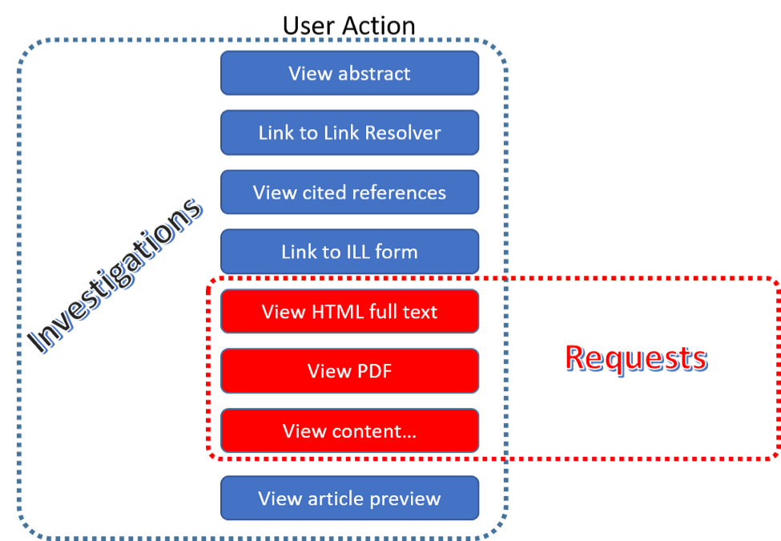

.. The COUNTER Code of Practice Release 5 © 2017-2023 by COUNTER
   is licensed under CC BY-SA 4.0. To view a copy of this license,
   visit https://creativecommons.org/licenses/by-sa/4.0/

COUNTER Report Common Attributes and Elements
---------------------------------------------

Early releases of the COUNTER Code of Practice focused on usage statistics related to journals. That was expanded to books, and later articles and multimedia collections were added. R5 further expands the scope of COUNTER into the area of research data and social media. In order to help organize this increased scope in a single, consistent, and coherent Code of Practice, several new elements and attributes have been added.

.. _host-types:

Host Types
""""""""""

Usage reports are provided by many different types of content hosts ranging from eBook to A&I_Database, eJournal, Discovery_Service, Multimedia etc. The usage reporting needs vary by Host_Type. To accommodate this variance, the R5 defines a set of Host_Type categories. Although the Host_Type does not appear on the COUNTER report, the Code of Practice uses Host_Types throughout this document to help content providers identify which reports, elements, metric types, and attributes are relevant to them. The Host_Types are:

Table 3.o (below): List of Host_Type Values

.. only:: latex

   .. tabularcolumns:: |>{\raggedright\arraybackslash}\Y{0.33}|>{\parskip=\tparskip}\Y{0.41}|>{\raggedright\arraybackslash}\Y{0.26}|

.. list-table::
   :class: longtable
   :widths: 23 57 20
   :header-rows: 1

   * - Host_Type
     - Description
     - Examples

   * - A&I_Database
     - Provides access to databases containing abstract and index information on scholarly articles intended to support discovery.
     - APA\ |br|\ |lb|
       EBSCOhost\ |br|\ |lb|
       ProQuest

   * - Aggregated_Full_Content
     - Provides access to aggregated pre-set databases of full text and other content where content is accessed in the context of the licensed database.
     - EBSCOhost\ |br|\ |lb|
       ProQuest

   * - Data_Repository
     - Includes subject repositories, institution, etc.
     - UK Data Service - ReShare\ |br|\ |lb|
       Figshare\ |br|\ |lb|
       DSpace\ |br|\ |lb|
       Eprints

   * - Discovery_Service
     - Assists users with discovery of scholarly content by providing access to a central index of articles, books, and other metadata.
     - EBSCOhost (EDS)\ |br|\ |lb|
       ProQuest (Primo/Summon)

   * - eBook
     - Provides access to eBook content made available as individual eBooks or eBook packages.
     - EBL\ |br|\ |lb|
       EBSCOhost\ |br|\ |lb|
       ScienceDirect

   * - eBook_Collection
     - Provides access to eBook content that is sold as fixed collections and behaves like databases.
     - EBSCOhost

   * - eJournal
     - Provides access to online serial (journals, conferences, newspapers, etc.) content made available as individual titles or packages.
     - ScienceDirect

   * - Full_Content_Database
     - Provides access to databases that are a collection of content items that are not otherwise part of a serial or monograph (i.e. non-aggregated).
     - Cochrane

   * - Multimedia
     - Provides access to audio, video, or other multimedia content.
     - Alexander Street Press

   * - Multimedia_Collection
     - Provides access to multimedia materials sold as and accessed like databases.
     -

   * - Repository
     - Provides access to an institution’s research output. Includes subject repositories, institution, department, etc.
     - Cranfield CERES

   * - Scholarly_Collaboration_Network
     - A service used by researchers to share information about their work.
     - Mendeley\ |br|\ |lb|
       Reddit/science

Note that a given content host may be classified as having multiple Host_Types and would be expected to provide reports, metric types, elements, and attributes applicable to all. For example, EBSCOhost would be classified as A&I_Database, Aggregated_Full_Content, Discovery_Service, eBook, and eBook_Collection.

.. _data-types:

Data Types
""""""""""

R5 reports on scholarly information in many ways. These major groupings, referred to as Data_Types, are listed in the table below along with the Host_Types and reports that they apply to. All Data_Types apply to the Platform Reports since they summarize the usage on the platform. Note that the table lists only Host_Types required to provide one or more reports for compliance, but that content providers may offer additional reports. For example, Host_Type eJournal might also offer IR and IR_A1 and would then use Data_Type Article in these reports.

Table 3.p (below): List of Data_Type Values

.. only:: latex

   .. tabularcolumns:: |>{\raggedright\arraybackslash}\Y{0.26}|>{\parskip=\tparskip}\Y{0.315}|>{\raggedright\arraybackslash}\Y{0.325}|>{\raggedright\arraybackslash}\Y{0.1}|

.. list-table::
   :class: longtable
   :widths: 20 43 24 13
   :header-rows: 1

   * - Data_Type
     - Description
     - Host_Types
     - Reports

   * - Article
     - An article, typically published in a journal or reference work. Note that Data_Type Article is only applicable for Item Reports when the article is the item, in Title Reports this is represented by the Section_Type.
     - Repository\ |br|\ |lb|
       Scholarly_Collaboration_Network
     - PR, IR\ |br|\ |lb|
       PR_P1, IR_A1

   * - Book
     - A monograph text.
     - A&I_Database\ |br|\ |lb|
       Aggregated_Full_Content\ |br|\ |lb|
       Discovery_Service\ |br|\ |lb|
       eBook\ |br|\ |lb|
       eBook_Collection\ |br|\ |lb|
       Repository\ |br|\ |lb|
       Scholarly_Collaboration_Network
     - PR, DR, TR, IR\ |br|\ |lb|
       PR_P1, DR_D1, TR_B1, TR_B2, TR_B3

   * - Book_Segment
     - A book segment (e.g. chapter, section, etc.). Note that Data_Type Book_Segment is only applicable for Item Reports when the book segment is the item, in Title Reports this is represented by the Section_Type.
     - Repository\ |br|\ |lb|
       Scholarly_Collaboration_Network
     - PR, IR\ |br|\ |lb|
       PR_P1

   * - Database
     - A fixed database where content is searched and accessed in the context of the database. A given item on the host may be in multiple databases but a transaction must be attributed to a specific database. Note that Data_Type Database is only applicable for Searches and Access Denied at the database level and for Investigations and Requests for Full_Content_Databases*.
     - A&I_Database\ |br|\ |lb|
       Aggregated_Full_Content\ |br|\ |lb|
       Discovery_Service\ |br|\ |lb|
       eBook_Collection\ |br|\ |lb|
       Full_Content_Database\ |br|\ |lb|
       Multimedia_Collection
     - PR, DR\ |br|\ |lb|
       PR_P1, DR_D1, DR_D2

   * - Dataset
     - A data set.
     - Data_Repository\ |br|\ |lb|
       Repository
     - PR, IR\ |br|\ |lb|
       PR_P1

   * - Journal
     - A serial that is a branded and continually growing collection of original articles within a particular discipline.
     - A&I_Database\ |br|\ |lb|
       Aggregated_Full_Content\ |br|\ |lb|
       Discovery_Service\ |br|\ |lb|
       eJournal\ |br|\ |lb|
       Repository
     - PR, DR, TR, IR\ |br|\ |lb|
       PR_P1, DR_D1, TR_J1, TR_J2, TR_J3, TR_J4

   * - Multimedia
     - Multimedia content such as audio, image, streaming audio, streaming video, and video.
     - Multimedia\ |br|\ |lb|
       Multimedia_Collection
     - PR, DR, IR\ |br|\ |lb|
       PR_P1, DR_D1, IR_M1

   * - Newspaper_or_Newsletter
     - Textual content published serially in a newspaper or newsletter.
     - A&I_Database\ |br|\ |lb|
       Aggregated_Full_Content\ |br|\ |lb|
       Discovery_Service\ |br|\ |lb|
       eJournal\ |br|\ |lb|
       Repository
     - PR, DR, TR, IR\ |br|\ |lb|
       PR_P1, DR_D1

   * - Other
     - Content that cannot be classified by any of the other Data_Types.

       Note that Data_Type Other MUST NOT be used if there isn’t sufficient information available to classify the content.
     - A&I_Database\ |br|\ |lb|
       Aggregated_Full_Content\ |br|\ |lb|
       Discovery_Service\ |br|\ |lb|
       Repository
     - PR, DR, TR, IR\ |br|\ |lb|
       PR_P1, DR_D1

   * - Platform
     - A content platform that may reflect usage from multiple Data_Types. Note that Data_Type Platform is only applicable for Searches_Platform.
     - All Host_Types
     - PR\ |br|\ |lb|
       PR_P1

   * - Report
     - A report.
     - A&I_Database\ |br|\ |lb|
       Aggregated_Full_Content\ |br|\ |lb|
       Discovery_Service\ |br|\ |lb|
       Repository
     - PR, DR, TR, IR\ |br|\ |lb|
       PR_P1, DR_D1

   * - Repository_Item
     - A generic classification used for items stored in a repository.
     - Repository
     - PR, IR\ |br|\ |lb|
       PR_P1

   * - Thesis_or_Dissertation
     - A thesis or dissertation.
     - A&I_Database\ |br|\ |lb|
       Aggregated_Full_Content\ |br|\ |lb|
       Discovery_Service\ |br|\ |lb|
       Repository
     - PR, DR, TR, IR\ |br|\ |lb|
       PR_P1, DR_D1

   * - Unspecified
     - It is not possible to classify the content because there isn’t sufficient information available.

       Note that content providers are expected to make all reasonable efforts to classify the content and that using Data_Type Unspecified may affect the result of an audit, see :numref:`missing-values` for details.
     - A&I_Database\ |br|\ |lb|
       Aggregated_Full_Content\ |br|\ |lb|
       Data_Repository\ |br|\ |lb|
       Discovery_Service\ |br|\ |lb|
       Repository\ |br|\ |lb|
       Scholarly_Collaboration_Network
     - PR, DR, TR, IR\ |br|\ |lb|
       PR_P1, DR_D1

\*Full_Content_Databases may also use Data_Type Database in the Title Report if this report is offered. All other Host_Types MUST report Investigations and Requests either with the title-level Data_Types (e.g. Journal for a journal article or Book for a book, from Host_Type A&I_Database, Aggregated_Full_Content, Discovery_Service, eBook, eBook_Collection and eJournal), or with the item-level Data_Types (e.g. Article for an article or Multimedia for a video from Host_Type Data_Repository, Multimedia, Multimedia_Collection, Repository and Scholarly_Collaboration_Network). These Data_Types MUST be used across all reports required for compliance to ensure a consistent reporting.

.. _section-types:

Section Types
"""""""""""""

Some scholarly content is accessed in sections. For example, a user may access a chapter or section at a time. Section_Type was introduced to provide a categorization of the transaction based on the type of section accessed. For example, a librarian could use a Title Report to see a breakdown of usage by Title and Section_Type. The following table lists the Section_Types defined by COUNTER and the Host_Types and reports to which they apply.

Table 3.q (below): List of Section_Type Values

.. only:: latex

   .. tabularcolumns:: |>{\raggedright\arraybackslash}\Y{0.16}|>{\parskip=\tparskip}\Y{0.47}|>{\raggedright\arraybackslash}\Y{0.26}|>{\raggedright\arraybackslash}\Y{0.11}|

.. list-table::
   :class: longtable
   :widths: 13 54 22 11
   :header-rows: 1

   * - Section_Type
     - Description
     - Host_Types
     - Reports

   * - Article
     - An article from a compilation, such as a journal, encyclopedia, or reference book.
     - Aggregated_Full_Content\ |br|\ |lb|
       eJournal
     - TR

   * - Book
     - A complete book, accessed as a single file.
     - Aggregated_Full_Content\ |br|\ |lb|
       eBook\ |br|\ |lb|
       eBook_Collection
     - TR

   * - Chapter
     - A chapter from a book.
     - Aggregated_Full_Content\ |br|\ |lb|
       eBook\ |br|\ |lb|
       eBook_Collection
     - TR

   * - Other
     - Content delivered in sections not otherwise represented on the list.
     - Aggregated_Full_Content
     - TR

   * - Section
     - A group of chapters or articles.
     - Aggregated_Full_Content\ |br|\ |lb|
       eBook\ |br|\ |lb|
       eBook_Collection\ |br|\ |lb|
       eJournal
     - TR

.. _metric-types:

Metric Types
""""""""""""

Metric_Types, which represent the nature of activity being counted, can be grouped into the categories of Searches, Investigations, Requests, and Access Denied. The Tables 3.r, 3.s and 3.t (below) list the Metric_Types and the Host_Types and reports they apply to.

.. rubric:: Searches

Table 3.r (below): List of Metric_Types for Searches

.. only:: latex

   .. tabularcolumns:: |>{\raggedright\arraybackslash}\Y{0.21}|>{\parskip=\tparskip}\Y{0.365}|>{\raggedright\arraybackslash}\Y{0.325}|>{\raggedright\arraybackslash}\Y{0.1}|

.. list-table::
   :class: longtable
   :widths: 17 50 24 9
   :header-rows: 1

   * - Metric_Type
     - Description
     - Host_Types
     - Reports

   * - Searches_Regular
     - Number of searches conducted against a database where results are returned to the user on the host UI and either a single database is searched, or multiple databases are searched and the user has the option of selecting the databases to be searched. This metric only applies to usage tracked at the database level and is not represented at the platform level.
     - A&I_Database\ |br|\ |lb|
       Aggregated_Full_Content\ |br|\ |lb|
       Discovery_Service\ |br|\ |lb|
       eBook_Collection\ |br|\ |lb|
       Full_Content_Database\ |br|\ |lb|
       Multimedia_Collection
     - DR\ |br|\ |lb|
       DR_D1

   * - Searches_Automated
     - Number of searches conducted against a database on the host site or discovery service where results are returned in the host UI, multiple databases are searched and the user does NOT have the option of selecting the databases to be searched. This metric only applies to usage that is tracked at the database level and is not represented at the platform level.
     - A&I_Database\ |br|\ |lb|
       Aggregated_Full_Content\ |br|\ |lb|
       Discovery_Service\ |br|\ |lb|
       eBook_Collection\ |br|\ |lb|
       Full_Content_Database\ |br|\ |lb|
       Multimedia_Collection
     - DR\ |br|\ |lb|
       DR_D1

   * - Searches_Federated
     - Searches conducted by a federated search engine where the search activity is conducted remotely via client-server technology. This metric only applies to usage that is tracked at the database level and is not represented at the platform level.
     - A&I_Database\ |br|\ |lb|
       Aggregated_Full_Content\ |br|\ |lb|
       Discovery_Service\ |br|\ |lb|
       eBook_Collection\ |br|\ |lb|
       Full_Content_Database\ |br|\ |lb|
       Multimedia_Collection
     - DR\ |br|\ |lb|
       DR_D1

   * - Searches_Platform
     - Searches conducted by users and captured at the platform level. Each user-initiated search can only be counted once regardless of the number of databases involved in the search. This metric only applies to Platform Reports.
     - All Host_Types
     - PR\ |br|\ |lb|
       PR_P1

\*Repositories should provide these Metric_Types if they are able to.

.. rubric:: Investigations and Requests of Items and Titles

This group of Metric_Types represents activities where content items were retrieved (Requests) or information about a content item (e.g. an abstract) was examined (Investigations). Any user activity that can be attributed to a content item will be considered an Investigation including downloading or viewing the item. Requests are limited to user activity related to retrieving or viewing the content item itself. The figure below provides a graphical representation of the relationship between Investigations and Requests.

.. centered:: Figure 3.e: The relationship between Investigations and Requests

.. rubric:: Totals, Unique Items and Unique Titles

R5 also introduces the concept of unique items and unique titles. The Metric_Types that begin with Total are very similar to the metrics of R4, i.e. if a given article or book or book chapter was accessed multiple times in a user session, the metric would increase by the number of times the content item was accessed (minus any adjustments for double-clicks).

Unique_Item metrics have been introduced in R5 to help eliminate the effect different styles of user interfaces may have on usage counts. With R5, if a single article is accessed multiple times in a given user session, the corresponding Unique_Item metric can only increase by 1 to simply indicate that the content item was accessed in the session. Unique_Item metrics provide comparable usage across journal platforms by reducing the inflationary effect that occurs when an HTML full text automatically displays and the user then accesses the PDF version.

Unique_Title metrics have been introduced in R5 to help normalize eBook metrics. Since eBooks can be downloaded as an entire book in a single PDF or as separate chapters, the counts for R4’s BR1 (book downloads) and BR2 (section downloads) are not comparable. With R5, the book’s Unique_Title metrics are only increased by 1 no matter how many (or how many times) chapters or sections were accessed in a given user session. Unique_Title metrics provide comparable eBook metrics regardless of the nature of the platform and how eBook content was delivered.

The Unique_Title metrics MUST NOT be used for Data_Types other than Book as they are not meaningful for them. If a book contains both OA_Gold and Controlled sections or sections with different YOPs, the usage must be broken down by Access_Type and YOP so that the total counts are consistent between reports including and not including these columns/elements.

Table 3.s (below): List of Metric_Types for Requests and Investigations

.. only:: latex

   .. tabularcolumns:: |>{\raggedright\arraybackslash}\Y{0.27}|>{\parskip=\tparskip}\Y{0.305}|>{\raggedright\arraybackslash}\Y{0.325}|>{\raggedright\arraybackslash}\Y{0.1}|

.. list-table::
   :class: longtable
   :widths: 21 42 24 13
   :header-rows: 1

   * - Metric_Type
     - Description
     - Host_Types
     - Reports

   * - Total_Item_Investigations
     - Total number of times a content item or information related to a content item was accessed. Double-click filters are applied to these transactions. Examples of content items are articles, book chapters, or multimedia files.
     - All Host_Types
     - PR, DR, TR, IR\ |br|\ |lb|
       DR_D1, TR_B3, TR_J3

   * - Unique_Item_Investigations
     - Number of unique content items investigated in a user-session. Examples of content items are articles, book chapters, or multimedia files.
     - All Host_Types
     - PR, DR, TR, IR\ |br|\ |lb|
       TR_B3, TR_J3

   * - Unique_Title_Investigations
     - Number of unique titles investigated in a user-session. This Metric_Type is only applicable for Data_Type Book.
     - A&I_Database\ |br|\ |lb|
       Aggregated_Full_Content\ |br|\ |lb|
       Discovery_Service\ |br|\ |lb|
       eBook\ |br|\ |lb|
       eBook_Collection
     - PR, DR, TR\ |br|\ |lb|
       TR_B3

   * - Total_Item_Requests
     - Total number of times a content item was requested (i.e. the full text or content was downloaded or viewed). Double-click filters are applied to these transactions. Examples of content items are articles, book chapters, or multimedia files.
     - Aggregated_Full_Content\ |br|\ |lb|
       Data_Repository\ |br|\ |lb|
       eBook\ |br|\ |lb|
       eBook_Collection\ |br|\ |lb|
       eJournal\ |br|\ |lb|
       Full_Content_Database\ |br|\ |lb|
       Multimedia\ |br|\ |lb|
       Multimedia_Collection\ |br|\ |lb|
       Repository\ |br|\ |lb|
       Scholarly_Collaboration_Network
     - PR, DR, TR, IR\ |br|\ |lb|
       PR_P1, DR_D1, TR_B1, TR_B3, TR_J1, TR_J3, TR_J4, IR_A1, IR_M1

   * - Unique_Item_Requests
     - Number of unique content items requested in a user-session. Examples of content items are articles, book chapters, or multimedia files.
     - Aggregated_Full_Content\ |br|\ |lb|
       Data_Repository\ |br|\ |lb|
       eBook\ |br|\ |lb|
       eBook_Collection\ |br|\ |lb|
       eJournal\ |br|\ |lb|
       Full_Content_Database\ |br|\ |lb|
       Multimedia\ |br|\ |lb|
       Multimedia_Collection\ |br|\ |lb|
       Repository\ |br|\ |lb|
       Scholarly_Collaboration_Network
     - PR, DR, TR, IR\ |br|\ |lb|
       PR_P1, TR_B3, TR_J1, TR_J3, TR_J4, IR_A1

   * - Unique_Title_Requests
     - Number of unique titles requested in a user-session. This Metric_Type is only applicable for Data_Type Book.
     - Aggregated_Full_Content\ |br|\ |lb|
       eBook\ |br|\ |lb|
       eBook_Collection
     - PR, DR, TR\ |br|\ |lb|
       PR_P1, TR_B1, TR_B3

\*Repositories should provide these Metric_Types if they are able to.

.. rubric:: Access Denied

Table 3.t (below): List of Metric_Types for Access Denied

.. only:: latex

   .. tabularcolumns:: |>{\raggedright\arraybackslash}\Y{0.18}|>{\parskip=\tparskip}\Y{0.395}|>{\raggedright\arraybackslash}\Y{0.325}|>{\raggedright\arraybackslash}\Y{0.1}|

.. list-table::
   :class: longtable
   :widths: 14 49 24 13
   :header-rows: 1

   * - Metric_Type
     - Description
     - Host_Types
     - Reports

   * - No_License
     - Number of times access was denied because the user’s institution did not have a license to the content. Double-click filtering applies to this Metric_Type.

       Note that if the user is automatically redirected to an abstract, that action will be counted as a No_License and also as an Item_Investigation.
     - A&I_Database\ |br|\ |lb|
       Aggregated_Full_Content\ |br|\ |lb|
       Discovery_Service\ |br|\ |lb|
       eBook\ |br|\ |lb|
       eBook_Collection\ |br|\ |lb|
       eJournal\ |br|\ |lb|
       Full_Content_Database\ |br|\ |lb|
       Multimedia\ |br|\ |lb|
       Multimedia_Collection\ |br|\ |lb|
       Scholarly_Collaboration_Network
     - DR, TR, IR\ |br|\ |lb|
       DR_D2, TR_B2, TR_J2

   * - Limit_Exceeded
     - Number of times access was denied because the licensed simultaneous-user limit for the user’s institution was exceeded. Double-click filtering applies to this Metric_Type.
     - A&I_Database\ |br|\ |lb|
       Aggregated_Full_Content\ |br|\ |lb|
       Discovery_Service\ |br|\ |lb|
       eBook\ |br|\ |lb|
       eBook_Collection\ |br|\ |lb|
       eJournal\ |br|\ |lb|
       Full_Content_Database\ |br|\ |lb|
       Multimedia\ |br|\ |lb|
       Multimedia_Collection\ |br|\ |lb|
       Scholarly_Collaboration_Network
     - DR, TR, IR\ |br|\ |lb|
       DR_D2, TR_B2, TR_J2

.. _access-types:

Access Types
""""""""""""

In order to track the value of usage for licensed content, librarians want to know how much Open Access or other freely available content was used and how much content was behind a paywall. To accommodate this R5 has introduced an Access_Type attribute with values of Controlled, OA_Gold, OA_Delayed, and Other_Free_To_Read. The table below lists the Access_Types and the Host_Types and reports they apply to. Note that Access_Type relates to access on the platform where the usage occurs: if access to a Gold Open Access article is restricted on a platform (for example because the article is included in an aggregated full-text database available to subscribers only) the Access_Type is Controlled.

Table 3.u (below): List of Access_Type Values

.. only:: latex

   .. tabularcolumns:: |>{\raggedright\arraybackslash}\Y{0.21}|>{\parskip=\tparskip}\Y{0.365}|>{\raggedright\arraybackslash}\Y{0.325}|>{\raggedright\arraybackslash}\Y{0.1}|

.. list-table::
   :class: longtable
   :widths: 16 47 24 13
   :header-rows: 1

   * - Access_Type
     - Description
     - Host_Types
     - Reports

   * - Controlled
     - At the time of the Request or Investigation the content item was not open (e.g. behind a paywall) because access is restricted to authorized users. Access of content due to a trial subscription/license would be considered Controlled.

       Platforms providing content that has been made freely available but is not OA_Gold (e.g. free for marketing purposes or because the title offers free access after a year) MUST be tracked as Controlled.
     - Aggregated_Full_Content\ |br|\ |lb|
       Data_Repository\ |br|\ |lb|
       eBook\ |br|\ |lb|
       eBook_Collection\ |br|\ |lb|
       eJournal\ |br|\ |lb|
       Multimedia\ |br|\ |lb|
       Repository\ |br|\ |lb|
       Scholarly_Collaboration_Network
     - TR, IR\ |br|\ |lb|
       TR_B1, TR_B2, TR_B3, TR_J1, TR_J2, TR_J3, TR_J4, IR_A1, IR_M1

   * - OA_Gold
     - At the time of the user Request or Investigation the content item was available under a Gold Open Access license (content that is immediately and permanently available as Open Access because an article processing charge applies or the publication process was sponsored by a library, society, or other organization). Content items may be in hybrid publications or fully Open Access publications.

       Note that content items offered as Delayed Open Access (open after an embargo period) MUST currently be classified as Controlled, pending the implementation of OA_Delayed.
     - Data_Repository\ |br|\ |lb|
       eBook\ |br|\ |lb|
       eJournal\ |br|\ |lb|
       Multimedia\ |br|\ |lb|
       Repository\ |br|\ |lb|
       Scholarly_Collaboration_Network
     - TR, IR\ |br|\ |lb|
       TR_B3, TR_J3, IR_A1, IR_M1

   * - OA_Delayed
     - \*\*\* RESERVED FOR FUTURE USE - DO NOT IMPLEMENT \*\*\*

       At the time of the user Request or Investigation the content item was available as Open Access after an embargo period had expired (Delayed Open Access). Note that author-archived works hosted in institutional repositories where access is restricted from public access for an embargo period will report usage as OA_Delayed for content accessed after the embargo period expires.

       NOTE: This value is not to be used until its inclusion has been approved by COUNTER and a timeframe for implementation published by COUNTER.
     -
     -

   * - Other_Free_To_Read
     - At the time of the transaction the content item was available as free-to-read (no license required) and did not qualify under the OA_Gold Access_Type.

       NOTE: This value is for institutional repositories only. Institutional repositories may also use Access_Type Other_Free_To_Read in the Title Report if this report is offered.
     - Data_Repository\ |br|\ |lb|
       Repository
     - IR\ |br|\ |lb|
       IR_A1

.. _access-methods:

Access Methods
""""""""""""""

In order to track content usage that was accessed for the purpose of text and data mining (TDM) and to keep that usage separate from normal usage, R5 introduces the Access_Method attribute, with values of Regular and TDM. The table below lists the Access_Methods and the Host_Types and reports they apply to.

Table 3.v (below): List of Access_Method Values

.. only:: latex

   .. tabularcolumns:: |>{\raggedright\arraybackslash}\Y{0.18}|>{\parskip=\tparskip}\Y{0.325}|>{\raggedright\arraybackslash}\Y{0.325}|>{\raggedright\arraybackslash}\Y{0.17}|

.. list-table::
   :class: longtable
   :widths: 14 49 24 13
   :header-rows: 1

   * - Access_Method
     - Description
     - Host_Types
     - Reports

   * - Regular
     - Refers to activities on a platform or content host that represent typical user behaviour.
     - All Host_Types
     - All COUNTER Reports and Standard Views of COUNTER Reports

   * - TDM
     - Content and metadata accessed for the purpose of text and data mining, e.g. through a specific API used for TDM. Note that usage representing TDM activity is to be included in COUNTER Reports only.
     - All Host_Types
     - PR, DR, TR, IR

.. _yop:

YOP
"""

Analyzing collection usage by the age of the content is also desired. The YOP report attribute represents the year of publication, and it must be tracked for all Investigations, Requests and Access Denied metrics in the Title and Item Reports. The table below lists the Host_Types and reports the YOP attribute applies to.

Table 3.w (below): YOP Values

.. only:: latex

   .. tabularcolumns:: |>{\raggedright\arraybackslash}\Y{0.09}|>{\parskip=\tparskip}\Y{0.41}|>{\raggedright\arraybackslash}\Y{0.33}|>{\raggedright\arraybackslash}\Y{0.17}|

.. list-table::
   :class: longtable
   :widths: 7 56 24 13
   :header-rows: 1

   * - YOP
     - Description
     - Host_Types
     - Reports

   * - *yyyy*
     - The year of publication for the item as a four-digit year. If a content item has a different year of publication for an online version than for the print version, use the year of publication for the Version of Record. If the year of publication is not known, use a value of 0001. For articles in press (not yet assigned to an issue), use the value 9999.
     - Aggregated_Full_Content\ |br|\ |lb|
       Data_Repository\ |br|\ |lb|
       eBook\ |br|\ |lb|
       eBook_Collection\ |br|\ |lb|
       eJournal\ |br|\ |lb|
       Multimedia\ |br|\ |lb|
       Repository\ |br|\ |lb|
       Scholarly_Collaboration_Network
     - TR, IR\ |br|\ |lb|
       TR_B1, TR_B2, TR_B3, TR_J1, TR_J2, TR_J3, TR_J4, IR_A1, IR_M1

.. _filters-attributes:

Report Filters and Report Attributes
""""""""""""""""""""""""""""""""""""

Customized views of the usage data are created by applying report filters and report attributes to the COUNTER Reports. The Standard Views of the COUNTER Reports specified by R5 are examples of such views. Report attributes define the columns (elements) and report filters the rows (values) included in the reports. For COUNTER Reports the user can choose from specific sets of filters and attributes depending on the report, while for Standard Views of the COUNTER Reports the filters and attributes are pre-set except for an optional Platform filter.

The filters and attributes used to create a report are included in the report header (unless the default value is used, in this case the filter/attribute MUST be omitted), for JSON reports as name/value pairs in the Report_Filters and Report_Attributes elements and for tabular reports encoded in the Metric_Types, Reporting_Period, Report_Filters and Report_Attributes elements (see :numref:`report-header` for the encoding). For the COUNTER_SUSHI API each filter/attribute corresponds to a method parameter with the same name in lower case (see the `COUNTER_SUSHI API Specification <https://app.swaggerhub.com/apis/COUNTER/counter-sushi_5_0_api/>`_ for details).

The tables below show the attributes and filters and the reports where they (might) appear in the header (excluding Standard Views using the default values).

Table 3.x (below): Report Attributes

.. only:: latex

   .. tabularcolumns:: |>{\raggedright\arraybackslash}\Y{0.28}|>{\parskip=\tparskip}\Y{0.55}|>{\raggedright\arraybackslash}\Y{0.17}|

.. list-table::
   :class: longtable
   :widths: 21 66 13
   :header-rows: 1

   * - Report Attribute
     - Description
     - Reports

   * - Attributes_To_Show
     - List of additional columns/elements to include in the report (default: none). See :numref:`platform-elements`, :numref:`database-elements`, :numref:`title-elements` and :numref:`item-elements` for permissible values. Note that the component and parent columns/elements cannot be selected individually and MUST NOT be included in the list (see the Include_Component_Details and Include_Parent_Details attributes below).
     - PR, DR, TR, IR

   * - Exclude_Monthly_Details
     - Specifies whether to exclude the columns with the monthly usage from the report. Permissible values are False (default) and True. This attribute is only applicable for tabular reports. The corresponding attribute for JSON reports is Granularity.
     - PR, DR, TR, IR\ |br|\ |lb|
       (tabular)

   * - Granularity
     - Specifies the granularity of the usage data to include in the report. Permissible values are Month (default) and Totals. This attribute is only applicable to JSON reports, the corresponding attribute for tabular reports is Exclude_Monthly_Details.

       For Totals each Item_Performance element represents the aggregated usage for the reporting period. Support for Month is REQUIRED for COUNTER compliance, support for Totals is optional.
     - PR, DR, TR, IR\ |br|\ |lb|
       (JSON)

   * - Include_Component_Details
     - Specifies whether to include the component columns/elements (see Table 3.k) in the report, where report providers offer component usage reporting. Permissible values are False (default) and True.
     - IR

   * - Include_Parent_Details
     - Specifies whether to include the parent columns/elements (see Table 3.j) in the report. Permissible values are False (default) and True.
     - IR

Table 3.y (below): Report Filters

.. only:: latex

   .. tabularcolumns:: |>{\raggedright\arraybackslash}\Y{0.2}|>{\parskip=\tparskip}\Y{0.63}|>{\raggedright\arraybackslash}\Y{0.17}|

.. list-table::
   :class: longtable
   :widths: 15 72 13
   :header-rows: 1

   * - Report Filter
     - Description
     - Reports

   * - Access_Method
     - List of Access_Methods for which to include usage (default: all). See :numref:`platform-filters`, :numref:`database-filters`, :numref:`title-filters` and :numref:`item-filters` for permissible/pre-set values.
     - All COUNTER Reports and Standard Views of COUNTER Reports

   * - Access_Type
     - List of Access_Types for which to include usage (default: all). See :numref:`title-filters` and :numref:`item-filters` for permissible/pre-set values.
     - TR, IR\ |br|\ |lb|
       TR_B1, TR_B2, TR_J1, TR_J2, TR_J4, IR_A1

   * - Begin_Date\ |br|\ |lb|
       End_Date
     - Beginning and end of the reporting period. Note that the COUNTER_SUSHI API allows the format *yyyy-mm* for the method parameters, which must be expanded with the first/last day of the month for the report header. For the tabular reports these filters are included in the Reporting_Period header instead of the Reporting_Filters header for easier reading.
     - All COUNTER Reports and Standard Views of COUNTER Reports

   * - Database
     - Name of a specific database for which usage is being requested (default: all). Support for this filter is optional but recommended for the reporting website.
     - DR

   * - Data_Type
     - List of Data_Types for which to include usage (default: all). See :numref:`platform-filters`, :numref:`database-filters`, :numref:`title-filters` and :numref:`item-filters` for permissible/pre-set values.
     - PR, DR, TR, IR\ |br|\ |lb|
       TR_B1, TR_B2, TR_B3, TR_J1, TR_J2, TR_J3, TR_J4, IR_A1, IR_M1

   * - Item_Contributor
     - Identifier of a specific contributor (author) for which usage is being requested (default: all). Support for this filter is optional but recommended for the reporting website.
     - IR

   * - Item_ID
     - Identifier of a specific item for which usage is being requested. Support for this filter is optional but recommended for the reporting website.
     - TR, IR

   * - Metric_Type
     - List of Metric_Types for which to include usage (default: all). See :numref:`platform-filters`, :numref:`database-filters`, :numref:`title-filters` and :numref:`item-filters` for permissible/pre-set values. For the tabular reports this filter is included in the Metric_Types header instead of the Reporting_Filters header for easier reading.
     - All COUNTER Reports and Standard Views of COUNTER Reports

   * - Platform
     - The Platform filter is only intended in cases where there is a single endpoint for multiple platforms; that is, the same base URL for the COUNTER_SUSHI API is used for multiple platforms and the platform parameter is required for all API calls. In the web interface this would correspond to first selecting one platform and then creating reports only for that platform.
     - All COUNTER Reports and Standard Views of COUNTER Reports

   * - Section_Type
     - List of Section_Types for which to include usage (default: all). See :numref:`title-filters` for permissible values.
     - TR

   * - YOP
     - Range of years of publication for which to include usage (default: all). For the COUNTER_SUSHI API more complex filter values (list of years and ranges) MUST be supported.
     - TR, IR

Zero Usage
""""""""""

Not all content providers or other COUNTER report providers link their COUNTER reporting tool to their subscription database, so R5 reports cannot include zero-usage reporting based on subscription records. Inclusion of zero-usage reporting for everything, including unsubscribed content, could make reports unmanageably large. The need for libraries to identify subscribed titles with zero usage will be addressed by the `KBART Automation Working Group <https://www.niso.org/standards-committees/kbart/kbart-automation>`_ initiative.

* For tabular reports

  * Omit any row where the Reporting_Period_Total would be zero.
  * If the Reporting_Period_Total is not zero, but usage for an included month is zero, set the cell value for that month to 0.

* For JSON reports

  * Omit any Instance element with a Count of zero.
  * Omit Performance elements that don’t have at least one Instance element.
  * Omit Report_Items elements that don’t have at least one Performance element.

.. _missing-values:

Missing and Unknown Values
""""""""""""""""""""""""""

The value for an element might be missing or unknown, for example a title might not have an ISBN or the ISBN might be unknown. In COUNTER reports this is expressed as follows:

* For tabular reports the cell MUST be left blank.
* For JSON reports

  * If the COUNTER_SUSHI API Specification (see :numref:`sushi`) indicates the element is REQUIRED, the value of the element MUST be expressed as empty as appropriate for the data type.
  * If the element is not REQUIRED according to the COUNTER_SUSHI API Specification, the element MUST be omitted.

For clarity, values such as “unknown”, “n/a” or “-” MUST NOT be used.

If a non-empty value is required for an element and the value is empty or the element is omitted, the COUNTER Release 5 Validation Tool reports a (Critical) Error which would cause the report to fail an audit. If Title, Item or Publisher is empty or Data_Type Unspecified is used, the COUNTER Release 5 Validation Tool reports a Warning which might affect the result of an audit. See :numref:`validation-tool` for details on the error levels used by the COUNTER Release 5 Validation Tool.
