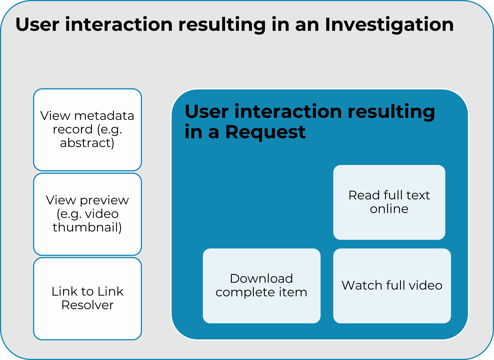

.. The COUNTER Code of Practice Release 5 © 2017-2023 by COUNTER
   is licensed under CC BY-SA 4.0. To view a copy of this license,
   visit https://creativecommons.org/licenses/by-sa/4.0/

COUNTER Report Common Attributes and Elements
---------------------------------------------

Early releases of the COUNTER Code of Practice focused on usage statistics related to journals. That was expanded to books, and later articles and multimedia collections were added. R5 further expanded the scope of COUNTER Reports. In order to help organize this increased scope in a consistent and coherent Code of Practice, several new elements and attributes have been added.

.. _host-types:

Host Types
""""""""""

Usage reports are provided by many different types of content hosts ranging from eBook to A&I_Database, eJournal, Discovery_Service, Multimedia etc. The usage reporting needs vary by Host_Type. To accommodate this variance, R5.1 defines a set of Host_Type categories. Although the Host_Type does not appear on the COUNTER report, the Code of Practice uses Host_Types throughout this document to help report providers identify which reports, elements, metric types, and attributes are relevant to them. The Host_Types are:

Table 3.o (below): List of Host_Type Values

.. only:: latex

   .. tabularcolumns:: |>{\raggedright\arraybackslash}\Y{0.33}|>{\parskip=\tparskip}\Y{0.41}|>{\raggedright\arraybackslash}\Y{0.26}|

.. list-table::
   :class: longtable
   :widths: 23 57 20
   :header-rows: 1

   * - Host_Type
     - Description
     - Examples

   * - A&I_Database
     - Provides access to databases containing abstract and index information on scholarly articles intended to support discovery.
     - APA\ |br|\ |lb|
       EBSCOhost\ |br|\ |lb|
       ProQuest

   * - Aggregated_Full_Content
     - Provides access to databases of full text serial and/or book content (monographs, reference works, etc.), and/or content otherwise aggregated into titles, where content is accessed in the context of the licensed database.
     - EBSCOhost\ |br|\ |lb|
       ProQuest

   * - Data_Repository
     - Includes subject repositories, institution, etc.
     - UK Data Service - ReShare\ |br|\ |lb|
       Figshare\ |br|\ |lb|
       DSpace\ |br|\ |lb|
       Eprints

   * - Discovery_Service
     - Assists users with discovery of scholarly content by providing access to a central index of articles, books, and other metadata.
     - EBSCOhost (EDS)\ |br|\ |lb|
       ProQuest (Primo/Summon)

   * - eBook
     - Provides access to eBook content made available as individual eBooks or eBook packages.
     - EBL\ |br|\ |lb|
       EBSCOhost\ |br|\ |lb|
       ScienceDirect

   * - eBook_Collection
     - Provides access to eBook content that is sold as fixed collections and behaves like databases.
     - EBSCOhost

   * - eJournal
     - Provides access to online serial (journals, conferences, newspapers, etc.) content made available as individual titles or packages.
     - ScienceDirect

   * - Full_Content_Database
     - A COUNTER Host_Type for report providers that offer databases that are a collection of content items that are not aggregated into titles (i.e. not part of a serial or book or other title). Full_Content_Database may include but not be exclusively composed of multimedia content items.
     - Cochrane

   * - Multimedia
     - Provides access to audio, video, or other multimedia content.
     - Alexander Street Press

   * - Multimedia_Collection
     - Provides access to multimedia materials sold as and accessed like databases.
     -

   * - Repository
     - Provides access to an institution’s research output. Includes subject repositories, institution, department, etc.
     - Cranfield CERES

   * - Scholarly_Collaboration_Network
     - A service used by researchers to share information about their work.
     - Mendeley\ |br|\ |lb|
       Reddit/science

Note that a given content host may be classified as having multiple Host_Types and would be expected to provide reports, metric types, elements, and attributes applicable to all. For example, EBSCOhost would be classified as A&I_Database, Aggregated_Full_Content, Discovery_Service, eBook, and eBook_Collection.

.. _data-types:

Data Types
""""""""""

To facilitate flexible reporting, R5 introduced Data_Types representing major groupings of content. The extended list of Data_Types for R5.1 is detailed in Table 3.p below.

The table lists the Data_Types and related Host_Types which use them in one or more reports for compliance, but Host_Types may choose to offer additional reports. For example, we encourage all Host_Types to offer the Global Item Report using all relevant Data_Types.

Report providers MUST report metrics in line with the following:

* Host_Types required to provide the TR MUST deliver title level information in the PR (e.g. Journal for a journal article or Book for a book). If the DR is also required, usage MUST be reported at the title level within the DR.
* Host_Types required to provide the TR and which choose to also offer the IR MUST report usage at the item level in IR (e.g. Article for a journal article, Book_Segment for a book).
* Host_Types that are required to provide the IR MUST also report at item level in the PR and, if required, the DR. Only certain Data_Type and Parent_Data_Type combinations are permitted, as detailed in Table 3.q.

Table 3.p (below): List of Data_Type Values

.. only:: latex

   .. tabularcolumns:: |>{\raggedright\arraybackslash}\Y{0.26}|>{\parskip=\tparskip}\Y{0.315}|>{\raggedright\arraybackslash}\Y{0.325}|>{\raggedright\arraybackslash}\Y{0.1}|

.. list-table::
   :class: longtable
   :widths: 20 43 24 13

   * - Data_Type
     - Description
     - Host_Types
     - Reports

   * - Article
     - An article from a journal, or an article available as a standalone piece of content (e.g. in an institutional repository) either as a preprint, an author accepted manuscript, a version of record, or another article version as defined by `NISO RP-8-2008, Journal Article Versions <https://www.niso.org/publications/niso-rp-8-2008-jav#:~:text=The%20Recommended%20Terms%20and%20Definitions,Version%20of%20Record%20(EVoR)>`_. Article SHOULD NOT be used for content other than journal articles.
     - Repository\ |br|\ |lb|
       Scholarly_Collaboration_Network
     - PR, IR\ |br|\ |lb|
       PR_P1

   * - Audiovisual
     - A form of multimedia, typically describing video content.
     - Full_Content_Database\ |br|\ |lb|
       Multimedia\ |br|\ |lb|
       Multimedia_Collection
     - PR, DR, IR\ |br|\ |lb|
       PR_P1, IR_M1

   * - Book
     - A monograph text, edited volume, textbook, or other form of book that is not a reference work.
     - A&I_Database\ |br|\ |lb|
       Aggregated_Full_Content\ |br|\ |lb|
       Discovery_Service\ |br|\ |lb|
       eBook\ |br|\ |lb|
       eBook_Collection\ |br|\ |lb|
     - PR, DR, TR\ |br|\ |lb|
       PR_P1, TR_B1, TR_B2, TR_B3

   * - Book_Segment
     - A segment of a book (e.g. chapter, section, etc.), or a segment available as a standalone piece of content available as a distinct item not aggregated into a title, for example in an institutional repository.
     
       Where a whole book is being downloaded and it is not possible to identify Book_Segments (i.e. where the report provider lacks metadata at the level of the Book_Segment), the whole book MUST be counted as a single Book_Segment.
     - Repository\ |br|\ |lb|
       Scholarly_Collaboration_Network
     - PR, IR\ |br|\ |lb|
       PR_P1

   * - Conference
     - A collection of papers, posters, or recordings of material associated with a conference. Typically part of a serial publication.
     - A&I_Database\ |br|\ |lb|
       Aggregated_Full_Content\ |br|\ |lb|
       Discovery_Service\ |br|\ |lb|
       eBook\ |br|\ |lb|
       eBook_Collection\ |br|\ |lb|
       eJournal\ |br|\ |lb|
     - PR, DR, TR\ |br|\ |lb|
       PR_P1

   * - Conference_Item
     - A single paper, poster, or recording of material associated with a conference. 
     - Repository\ |br|\ |lb|
       Scholarly_Collaboration_Network
     - PR, IR\ |br|\ |lb|
       PR_P1

   * - Database_Aggregated
     - *Only applies to Denial and Search metrics.*
     
       Activity within an aggregated database of full text serial and/or monograph content, or content otherwise aggregated into titles. A given item on the host may be in multiple databases but a transaction must be attributed to a specific database. Activity that would result in Investigation and Request metrics must be reported against the appropriate title level Data_Type (e.g. Journal for a journal article).
     - Aggregated_Full_Content\ |br|\ |lb|
       eBook_Collection
     - DR

   * - Database_AI
     - *Only applies to Denial and Search metrics.*
     
       Activity within a fixed database where bibliographic metadata is searched and accessed in the context of the database. A given item on the host may be in multiple databases but a transaction must be attributed to a specific database. Activity that would result in Investigation and Request metrics must be reported against the appropriate Data_Type (e.g. Journal for a journal article).
     - A&I_Database\ |br|\ |lb|
       Discovery_Service
     - DR

   * - Database_Full
     - *Only applies to Denial and Search metrics.*
     
       Activity within databases that are a collection of content items that are not aggregated into titles. A given item on the host may be in multiple databases but a transaction must be attributed to a specific database. Activity that would result in Investigation and Request metrics must be reported against the appropriate item-level Data_Type (e.g. Multimedia).
     - Full_Content_Database\ |br|\ |lb|
       Multimedia_Collection
     - DR

   * - Database_Full_Item
     - Usage of an item from a Full_Content_Database. Database_Full_Item applies where Investigations and Requests are being reported and a more specific Data_Type cannot be applied.
     - Full_Content_Database
     - PR, DR, IR\ |br|\ |lb|
       PR_P1

   * - Dataset
     - Data encoded in a defined structure, for example data associated with a research project.
     - Data_Repository\ |br|\ |lb|
       Repository
     - PR, IR\ |br|\ |lb|
       PR_P1

   * - Image
     - A form of multimedia describing a static visual image.
     - Full_Content_Database\ |br|\ |lb|
       Multimedia\ |br|\ |lb|
       Multimedia_Collection
     - PR, DR, IR\ |br|\ |lb|
       PR_P1, IR_M1

   * - Interactive_Resource
     - A form of multimedia, typically describing materials that require user interaction to be understood, executed, or experienced (e.g. quizzes).
     - Full_Content_Database\ |br|\ |lb|
       Multimedia\ |br|\ |lb|
       Multimedia_Collection
     - PR, DR, IR\ |br|\ |lb|
       PR_P1, IR_M1

   * - Journal
     - A serial that is a branded and continually growing collection of original articles within a particular discipline.
     - A&I_Database\ |br|\ |lb|
       Aggregated_Full_Content\ |br|\ |lb|
       Discovery_Service\ |br|\ |lb|
       eJournal\ |br|\ |lb|
       Repository
     - PR, DR, TR\ |br|\ |lb|
       PR_P1

   * - Multimedia
     - Multimedia content such as audio, image, streaming audio, streaming video, and video, that cannot be easily classified as a specific multimedia Data_Type.
     - Full_Content_Database\ |br|\ |lb|
       Multimedia\ |br|\ |lb|
       Multimedia_Collection
     - PR, DR, IR\ |br|\ |lb|
       PR_P1, IR_M1

   * - News_Item
     - An article from a newspaper or magazine, or a news item available as a standalone piece of content available as a distinct item not aggregated into a title, for example in an institutional repository.
     - Repository\ |br|\ |lb|
       Scholarly_Collaboration_Network
     - PR, IR\ |br|\ |lb|
       PR_P1

   * - Newspaper_or_Newsletter
     - Textual content published serially in a newspaper or newsletter.
     - A&I_Database\ |br|\ |lb|
       Aggregated_Full_Content\ |br|\ |lb|
       Discovery_Service\ |br|\ |lb|
       eJournal
     - PR, DR, TR\ |br|\ |lb|
       PR_P1

   * - Other
     - Content that has been labelled with a data type that does not exist within and cannot be mapped to COUNTER’s Code of Practice. Other MUST NOT be used if there is not sufficient information available to classify the content.
     - A&I_Database\ |br|\ |lb|
       Aggregated_Full_Content\ |br|\ |lb|
       Discovery_Service\ |br|\ |lb|
       Repository
     - PR, DR, TR, IR\ |br|\ |lb|
       PR_P1

   * - Patent
     - A patent document representing an exclusive right granted for an invention, which is a product or a process that provides, in general, a new way of doing something, or offers a new technical solution to a problem. Typically associated with a patent number.
     - A&I_Database\ |br|\ |lb|
       Discovery_Service\ |br|\ |lb|
       Full_Content_Database\ |br|\ |lb|
       Repository\ |br|\ |lb|
       Scholarly_Collaboration_Network
     - PR, DR, TR, IR\ |br|\ |lb|
       PR_P1

   * - Platform
     - *Only applies to Searches_Platform metrics.*
     - All Host_Types
     - PR\ |br|\ |lb|
       PR_P1

   * - Reference_Item
     - An item or record within a reference work (e.g. an encylopedia reference), or a reference item available as a standalone piece of content available as a distinct item not aggregated into a title, for example in an institutional repository. 

       Where a whole reference work is being downloaded and it is not possible to identify Reference_Items (i.e. the report provider lacks metadata about individual Reference_Items), the whole reference work MUST be counted as a single Reference_Item.
     - Repository\ |br|\ |lb|
       Scholarly_Collaboration_Network
     - PR, IR\ |br|\ |lb|
       PR_P1

   * - Reference_Work
     - An authoritative source of information about a subject used to find quick answers to questions, such as an encyclopedia or dictionary. The content may be stable or updated over time.
     - A&I_Database\ |br|\ |lb|
       Aggregated_Full_Content\ |br|\ |lb|
       Discovery_Service\ |br|\ |lb|
       eBook\ |br|\ |lb|
       eBook_Collection
     - PR, DR, TR\ |br|\ |lb|
       PR_P1, TR_B1, TR_B2, TR_B3

   * - Report
     - A document presenting information in an organized format for a specific audience and purpose, such as a policy report.
     - A&I_Database\ |br|\ |lb|
       Aggregated_Full_Content\ |br|\ |lb|
       Discovery_Service\ |br|\ |lb|
       Repository\ |br|\ |lb|
       Scholarly_Collaboration_Network
     - PR, DR, TR, IR\ |br|\ |lb|
       PR_P1

   * - Software
     - Source code or compiled software, or a virtual notebook environment used for programming.
     - Data_Repository\ |br|\ |lb|
       Repository
     - PR, IR\ |br|\ |lb|
       PR_P1

   * - Sound
     - A form of multimedia, typically describing materials that are audio-only, such as radio programmes.
     - Full_Content_Database\ |br|\ |lb|
       Multimedia\ |br|\ |lb|
       Multimedia_Collection
     - PR, DR, IR\ |br|\ |lb|
       PR_P1, IR_M1

   * - Standard
     - A document outlining processes agreed and established by authority or by general consent (e.g. materials from NISO).
     - A&I_Database\ |br|\ |lb|
       Aggregated_Full_Content\ |br|\ |lb|
       Discovery_Service\ |br|\ |lb|
       Repository\ |br|\ |lb|
       Scholarly_Collaboration_Network
     - PR, DR, TR, IR\ |br|\ |lb|
       PR_P1

   * - Thesis_or_Dissertation
     - A thesis or dissertation, such as one written by a PhD candidate.
     - A&I_Database\ |br|\ |lb|
       Aggregated_Full_Content\ |br|\ |lb|
       Discovery_Service\ |br|\ |lb|
       Repository\ |br|\ |lb|
       Scholarly_Collaboration_Network
     - PR, DR, TR, IR\ |br|\ |lb|
       PR_P1

   * - Unspecified
     - Content that cannot be classified by any of the other Data_Types due to lack of sufficient information. Note that report providers are expected to make all reasonable efforts to classify the content. Using Unspecified will give rise to a Warning in the Validation Tool.
     - A&I_Database\ |br|\ |lb|
       Aggregated_Full_Content\ |br|\ |lb|
       Data_Repository\ |br|\ |lb|
       Discovery_Service\ |br|\ |lb|
       Repository\ |br|\ |lb|
       Scholarly_Collaboration_Network
     - PR, DR, TR, IR\ |br|\ |lb|
       PR_P1

Some Data_Types are associated with Parent_Data_Types. For example, Data_Type Article has Parent_Data_Type Journal, while Data_Type Book_Segment has Parent_Data_Type Book.

* Host_Types that MUST offer an IR MUST provide Parent_Data_Type and other relevant parent information if it is available.
* Host_Types that choose to offer an IR (e.g. eJournal or eBook) SHOULD provide Parent_Data_Type and other relevant parent information as specified in the table.
* Data_Types MUST NOT be used with other Parent_Data_Types than those listed in the table.

Table 3.q (below): List of Parent_Data_Type Values and Associated Data_Types

.. only:: latex

   .. tabularcolumns:: |>{\raggedright\arraybackslash}\Y{0.2}|>{\parskip=\tparskip}\Y{0.29}|

.. list-table::
   :class: longtable
   :widths: 20 29
   :header-rows: 1

   * - Data_Type in IR
     - Parent_Data_Type in IR

   * - Article
     - Journal

   * - Book_Segment
     - Book

   * - Conference_Item
     - Conference

   * - Database_Full_Item
     - Database_Full

   * - News_Item
     - Newspaper_or_Newsletter

   * - Reference_Item
     - Reference_Work

.. _metric-types:

Metric Types
""""""""""""

Metric_Types, which represent the nature of activity being counted, can be grouped into the categories of Searches, Investigations, Requests, and Access Denied. The Tables 3.r, 3.s and 3.t (below) list the Metric_Types and the Host_Types and reports they apply to.

.. rubric:: Searches

Table 3.r (below): List of Metric_Types for Searches

.. only:: latex

   .. tabularcolumns:: |>{\raggedright\arraybackslash}\Y{0.21}|>{\parskip=\tparskip}\Y{0.365}|>{\raggedright\arraybackslash}\Y{0.325}|>{\raggedright\arraybackslash}\Y{0.1}|

.. list-table::
   :class: longtable
   :widths: 17 50 24 9
   :header-rows: 1

   * - Metric_Type
     - Description
     - Host_Types
     - Reports

   * - Searches_Regular
     - Number of searches conducted against a database where results are returned to the user on the host UI and either a single database is searched, or multiple databases are searched and the user has the option of selecting the databases to be searched. This metric only applies to usage tracked at the database level and is not represented at the platform level.
     - A&I_Database\ |br|\ |lb|
       Aggregated_Full_Content\ |br|\ |lb|
       Discovery_Service\ |br|\ |lb|
       eBook_Collection\ |br|\ |lb|
       Full_Content_Database\ |br|\ |lb|
       Multimedia_Collection
     - DR\ |br|\ |lb|
       DR_D1

   * - Searches_Automated
     - Number of searches conducted against a database on the host site or discovery service where results are returned in the host UI, multiple databases are searched and the user does NOT have the option of selecting the databases to be searched. This metric only applies to usage that is tracked at the database level and is not represented at the platform level.
     - A&I_Database\ |br|\ |lb|
       Aggregated_Full_Content\ |br|\ |lb|
       Discovery_Service\ |br|\ |lb|
       eBook_Collection\ |br|\ |lb|
       Full_Content_Database\ |br|\ |lb|
       Multimedia_Collection
     - DR\ |br|\ |lb|
       DR_D1

   * - Searches_Federated
     - Searches conducted by a federated search engine where the search activity is conducted remotely via client-server technology. This metric only applies to usage that is tracked at the database level and is not represented at the platform level.
     - A&I_Database\ |br|\ |lb|
       Aggregated_Full_Content\ |br|\ |lb|
       Discovery_Service\ |br|\ |lb|
       eBook_Collection\ |br|\ |lb|
       Full_Content_Database\ |br|\ |lb|
       Multimedia_Collection
     - DR\ |br|\ |lb|
       DR_D1

   * - Searches_Platform
     - Searches conducted by users and captured at the platform level. Each user-initiated search can only be counted once regardless of the number of databases involved in the search. This metric only applies to Platform Reports.
     - All Host_Types
     - PR\ |br|\ |lb|
       PR_P1

\*Repositories should provide these Metric_Types if they are able to.

.. rubric:: Investigations and Requests of Items and Titles

This group of Metric_Types represents activities where content items were retrieved (Requests) or information about a content item (e.g. an abstract) was examined (Investigations). Any user activity that can be attributed to a content item will be considered an Investigation including downloading or viewing the item. Requests are limited to user activity related to retrieving or viewing the content item itself. The figure below provides a graphical representation of the relationship between Investigations and Requests.

.. centered:: Figure 3.e: The Relationship between Investigations and Requests

.. rubric:: Totals, Unique Items and Unique Titles

R5 also introduced the concept of unique items and unique titles.

Unique_Item metrics were introduced in R5 to help eliminate the effect different styles of user interfaces may have on usage counts. With R5.1, if a single article is accessed multiple times in a given user session, the corresponding Unique_Item metric can only increase by 1 to simply indicate that the content item was accessed in the session. Unique_Item metrics provide comparable usage across journal platforms by reducing the inflationary effect that occurs when an HTML full text automatically displays and the user then accesses the PDF version.

The method for counting book usage in R5.1 at the item level is different than it was in R5. In R5.1, a Unique_Item_Investigation or Unique_Item_Request MUST be counted for each item (Book_Segment) that is used, independent of the method of content delivery.

* Where Book_Segments can be identified within a Book, a Unique_Item_Investigation MUST be counted for each Book_Segment with which a user interacts and a Unique_Item_Request counted for each Book_Segment accessed in full. This includes where users download or view the whole book as a single file.
* Where it is not possible to identify Book_Segments, the whole book MUST be counted as a single Book_Segment.
* The same rules apply to identifying and counting usage of other items within aggregated works, such as Reference_Items within Reference_Works or News_Items within Newspaper_or_Newsletters.

This change facilitates consistent reporting on items within the Item Report, and permits more accurate comparisons of usage across Data_Types, while retaining the ability to compare book usage across platforms through Unique_Title_Investigations and Unique_Title_Requests.

Unique_Title metrics were introduced in R5 to help normalize eBook metrics, and are retained in R5.1. Unique_Title metrics are only increased by 1 no matter how many (or how many times) chapters or sections are accessed in a given user session. Unique_Title metrics provide comparable eBook metrics regardless of the nature of the platform and how eBook content is delivered. They are comparable across report providers and across releases.

The Unique_Title metrics MUST NOT be used for Data_Types other than Book and Reference_Work as they are not meaningful for them. If a title contains both Open and Controlled sections or sections with different YOPs, the usage must be broken down by Access_Type and YOP so that the total counts are consistent between reports including and not including these columns/elements.

Table 3.s (below): List of Metric_Types for Requests and Investigations

.. only:: latex

   .. tabularcolumns:: |>{\raggedright\arraybackslash}\Y{0.27}|>{\parskip=\tparskip}\Y{0.305}|>{\raggedright\arraybackslash}\Y{0.325}|>{\raggedright\arraybackslash}\Y{0.1}|

.. list-table::
   :class: longtable
   :widths: 21 42 24 13
   :header-rows: 1

   * - Metric_Type
     - Description
     - Host_Types
     - Reports

   * - Total_Item_Investigations
     - Total number of times a content item or information related to a content item was accessed. Double-click filters are applied to these transactions. Examples of content items are articles, book chapters, or multimedia files.
     - All Host_Types
     - PR, DR, TR, IR\ |br|\ |lb|
       DR_D1, TR_B3, TR_J3

   * - Unique_Item_Investigations
     - Number of unique content items investigated in a user-session. Examples of content items are articles, book chapters, or multimedia files.
     - All Host_Types
     - PR, DR, TR, IR\ |br|\ |lb|
       TR_B3, TR_J3

   * - Unique_Title_Investigations
     - Number of unique titles investigated in a user-session. This Metric_Type is only applicable for Data_Types Book and Reference_Work.
     - A&I_Database\ |br|\ |lb|
       Aggregated_Full_Content\ |br|\ |lb|
       Discovery_Service\ |br|\ |lb|
       eBook\ |br|\ |lb|
       eBook_Collection
     - PR, DR, TR\ |br|\ |lb|
       TR_B3

   * - Total_Item_Requests
     - Total number of times a content item was requested (i.e. the full text or content was downloaded or viewed). Double-click filters are applied to these transactions. Examples of content items are articles, book chapters, or multimedia files.
     - Aggregated_Full_Content\ |br|\ |lb|
       Data_Repository\ |br|\ |lb|
       eBook\ |br|\ |lb|
       eBook_Collection\ |br|\ |lb|
       eJournal\ |br|\ |lb|
       Full_Content_Database\ |br|\ |lb|
       Multimedia\ |br|\ |lb|
       Multimedia_Collection\ |br|\ |lb|
       Repository\ |br|\ |lb|
       Scholarly_Collaboration_Network
     - PR, DR, TR, IR\ |br|\ |lb|
       PR_P1, DR_D1, TR_B1, TR_B3, TR_J1, TR_J3, TR_J4, IR_A1, IR_M1

   * - Unique_Item_Requests
     - Number of unique content items requested in a user-session. Examples of content items are articles, book chapters, or multimedia files.
     - Aggregated_Full_Content\ |br|\ |lb|
       Data_Repository\ |br|\ |lb|
       eBook\ |br|\ |lb|
       eBook_Collection\ |br|\ |lb|
       eJournal\ |br|\ |lb|
       Full_Content_Database\ |br|\ |lb|
       Multimedia\ |br|\ |lb|
       Multimedia_Collection\ |br|\ |lb|
       Repository\ |br|\ |lb|
       Scholarly_Collaboration_Network
     - PR, DR, TR, IR\ |br|\ |lb|
       PR_P1, TR_B3, TR_J1, TR_J3, TR_J4, IR_A1

   * - Unique_Title_Requests
     - Number of unique titles requested in a user-session. This Metric_Type is only applicable for Data_Types Book and Reference_Work.
     - Aggregated_Full_Content\ |br|\ |lb|
       eBook\ |br|\ |lb|
       eBook_Collection
     - PR, DR, TR\ |br|\ |lb|
       PR_P1, TR_B1, TR_B3

\*Repositories should provide these Metric_Types if they are able to.

.. rubric:: Access Denied

Table 3.t (below): List of Metric_Types for Access Denied

.. only:: latex

   .. tabularcolumns:: |>{\raggedright\arraybackslash}\Y{0.18}|>{\parskip=\tparskip}\Y{0.395}|>{\raggedright\arraybackslash}\Y{0.325}|>{\raggedright\arraybackslash}\Y{0.1}|

.. list-table::
   :class: longtable
   :widths: 14 49 24 13
   :header-rows: 1

   * - Metric_Type
     - Description
     - Host_Types
     - Reports

   * - No_License
     - Number of times access was denied because the user’s institution did not have a license to the content. Double-click filtering applies to this Metric_Type.

       Note that if the user is automatically redirected to an abstract, that action will be counted as a No_License and also as an Item_Investigation.
     - A&I_Database\ |br|\ |lb|
       Aggregated_Full_Content\ |br|\ |lb|
       Discovery_Service\ |br|\ |lb|
       eBook\ |br|\ |lb|
       eBook_Collection\ |br|\ |lb|
       eJournal\ |br|\ |lb|
       Full_Content_Database\ |br|\ |lb|
       Multimedia\ |br|\ |lb|
       Multimedia_Collection\ |br|\ |lb|
       Scholarly_Collaboration_Network
     - DR, TR, IR\ |br|\ |lb|
       DR_D2, TR_B2, TR_J2

   * - Limit_Exceeded
     - Number of times access was denied because the licensed simultaneous-user limit for the user’s institution was exceeded. Double-click filtering applies to this Metric_Type.
     - A&I_Database\ |br|\ |lb|
       Aggregated_Full_Content\ |br|\ |lb|
       Discovery_Service\ |br|\ |lb|
       eBook\ |br|\ |lb|
       eBook_Collection\ |br|\ |lb|
       eJournal\ |br|\ |lb|
       Full_Content_Database\ |br|\ |lb|
       Multimedia\ |br|\ |lb|
       Multimedia_Collection\ |br|\ |lb|
       Scholarly_Collaboration_Network
     - DR, TR, IR\ |br|\ |lb|
       DR_D2, TR_B2, TR_J2

.. _access-types:

Access Types
""""""""""""

In order to separately track the usage of subscribed content, open access content, and freely available materials, R5.1 uses the Access_Type attribute with values of Controlled, Open, and Free_To_Read. The table below lists the Access_Types and the Host_Types and reports they apply to.

Note that the values for Access_Type changed in R5.1 to reflect community needs around reporting and to address common misunderstandings.

The Access_Type applied to an item MUST adhere to the following principles:

* Access_Type relates to access on the platform where the usage occurs: if access to a content item is restricted on a platform (for example because the article is included in an aggregated full-text database available to subscribers only) the Access_Type is Controlled, even if the content item is Open on a different platform.
* Access_Type applies to all parts of a content item. That is, the metadata, the full-text (if any) and supplementary materials (if any) all share a single Access_Type. For a journal article, for example, an Investigation of the article metadata must be reported under the same Access_Type as a Request for the full article.
* Access_Type applies in all circumstances. That is, an item MUST NOT be reported as Open for one user and as Controlled for a different user.

Table 3.u (below): List of Access_Type Values

.. only:: latex

   .. tabularcolumns:: |>{\raggedright\arraybackslash}\Y{0.21}|>{\parskip=\tparskip}\Y{0.365}|>{\raggedright\arraybackslash}\Y{0.325}|>{\raggedright\arraybackslash}\Y{0.1}|

.. list-table::
   :class: longtable
   :widths: 16 47 24 13
   :header-rows: 1

   * - Access_Type
     - Description
     - Host_Types
     - Reports

   * - Controlled
     - At the time of the Request or Investigation the content item was restricted to authorized users (e.g. behind a paywall) on this platform. This includes free content that is only available to authorized (registered) users.
     - Aggregated_Full_Content\ |br|\ |lb|
       Data_Repository\ |br|\ |lb|
       eBook\ |br|\ |lb|
       eBook_Collection\ |br|\ |lb|
       eJournal\ |br|\ |lb|
       Multimedia\ |br|\ |lb|
       Repository\ |br|\ |lb|
       Scholarly_Collaboration_Network
     - TR, IR\ |br|\ |lb|
       TR_B1, TR_B2, TR_B3, TR_J1, TR_J2, TR_J3, TR_J4, IR_A1, IR_M1

   * - Open
     - At the time of the Request or Investigation the content item was available to all users on this platform, regardless of authorization status, under an open access model. Open applies where the report provider asserts that the content is open access, irrespective of the license associated with the content item (that is, while the content item may be under a Creative Commons license this is not essential). Open content items may be in hybrid or fully open access publications. Open content items may have been Open from the day of publication, or after expiry of an embargo, but are not intended to return to Controlled status.
     - Aggregated_Full_Content\ |br|\ |lb|
       Data_Repository\ |br|\ |lb|
       eBook\ |br|\ |lb|
       eBook_Collection\ |br|\ |lb|
       eJournal\ |br|\ |lb|
       Multimedia\ |br|\ |lb|
       Repository\ |br|\ |lb|
       Scholarly_Collaboration_Network
     - TR, IR\ |br|\ |lb|
       TR_B3, TR_J3, IR_A1, IR_M1

   * - Free_To_Read
     - At the time of the Request or Investigation the content item was available to all users on this platform, regardless of authorization status, but was not Open. The content item may or may not have been Controlled at some point in the past, and may or may not return to Controlled status in the future (e.g. promotional materials where these can be tracked by the platform, or archival content a publisher has made free to read).
     - Aggregated_Full_Content\ |br|\ |lb|
       Data_Repository\ |br|\ |lb|
       eBook\ |br|\ |lb|
       eBook_Collection\ |br|\ |lb|
       eJournal\ |br|\ |lb|
       Multimedia\ |br|\ |lb|
       Repository\ |br|\ |lb|
       Scholarly_Collaboration_Network
     - TR, IR\ |br|\ |lb|
       TR_B3, TR_J3, IR_A1, IR_M1

.. _access-methods:

Access Methods
""""""""""""""

In order to track content usage accessed for the purpose of text and data mining (TDM) and to keep that usage separate from normal usage, R5 introduced the Access_Method attribute, with values of Regular and TDM. The table below lists the Access_Methods and the Host_Types and reports they apply to.

Table 3.v (below): List of Access_Method Values

.. only:: latex

   .. tabularcolumns:: |>{\raggedright\arraybackslash}\Y{0.18}|>{\parskip=\tparskip}\Y{0.325}|>{\raggedright\arraybackslash}\Y{0.325}|>{\raggedright\arraybackslash}\Y{0.17}|

.. list-table::
   :class: longtable
   :widths: 14 49 24 13
   :header-rows: 1

   * - Access_Method
     - Description
     - Host_Types
     - Reports

   * - Regular
     - Refers to activities on a platform or content host that represent typical user behaviour.
     - All Host_Types
     - All COUNTER Reports and Standard Views of COUNTER Reports

   * - TDM
     - Content and metadata accessed for the purpose of text and data mining, e.g. through a specific API used for TDM. Note that usage representing TDM activity is to be included in COUNTER Reports only.
     - All Host_Types
     - PR, DR, TR, IR

.. _yop:

YOP
"""

Analyzing collection usage by the age of the content is also desired. The YOP report attribute represents the year of publication, and it must be tracked for all Investigations, Requests and Access Denied metrics in the Title and Item Reports. The table below lists the Host_Types and reports the YOP attribute applies to.

Table 3.w (below): YOP Values

.. only:: latex

   .. tabularcolumns:: |>{\raggedright\arraybackslash}\Y{0.09}|>{\parskip=\tparskip}\Y{0.41}|>{\raggedright\arraybackslash}\Y{0.33}|>{\raggedright\arraybackslash}\Y{0.17}|

.. list-table::
   :class: longtable
   :widths: 7 56 24 13
   :header-rows: 1

   * - YOP
     - Description
     - Host_Types
     - Reports

   * - *yyyy*
     - The year of publication for the item as a four-digit year. If a content item has a different year of publication for an online version than for the print version, use the year of publication for the Version of Record. If the year of publication is not known, use a value of 0001. For articles in press (not yet assigned to an issue), use the value 9999.
     - Aggregated_Full_Content\ |br|\ |lb|
       Data_Repository\ |br|\ |lb|
       eBook\ |br|\ |lb|
       eBook_Collection\ |br|\ |lb|
       eJournal\ |br|\ |lb|
       Multimedia\ |br|\ |lb|
       Repository\ |br|\ |lb|
       Scholarly_Collaboration_Network
     - TR, IR\ |br|\ |lb|
       TR_B1, TR_B2, TR_B3, TR_J1, TR_J2, TR_J3, TR_J4, IR_A1, IR_M1

.. _filters-attributes:

Report Filters and Report Attributes
""""""""""""""""""""""""""""""""""""

Customized views of the usage data are created by applying report filters and report attributes to the COUNTER Reports. The Standard Views of the COUNTER Reports specified by R5.1 are examples of such views. Report attributes define the columns (elements) and report filters the rows (values) included in the reports. For COUNTER Reports the user can choose from specific sets of filters and attributes depending on the report, while for Standard Views of the COUNTER Reports the filters and attributes are pre-set except for an optional Platform filter.

The filters and attributes used to create a report are included in the report header (unless the default value is used, in this case the filter/attribute MUST be omitted), for JSON reports as name/value pairs in the Report_Filters and Report_Attributes elements and for tabular reports encoded in the Metric_Types, Reporting_Period, Report_Filters and Report_Attributes elements (see :numref:`report-header` for the encoding). For the COUNTER_SUSHI API each filter/attribute corresponds to a method parameter with the same name in lower case (see the `COUNTER_SUSHI API Specification <https://app.swaggerhub.com/apis/COUNTER/counter-sushi_5_0_api/>`_ for details).

The tables below show the attributes and filters and the reports where they (might) appear in the header (excluding Standard Views using the default values).

Table 3.x (below): Report Attributes

.. only:: latex

   .. tabularcolumns:: |>{\raggedright\arraybackslash}\Y{0.28}|>{\parskip=\tparskip}\Y{0.55}|>{\raggedright\arraybackslash}\Y{0.17}|

.. list-table::
   :class: longtable
   :widths: 21 66 13
   :header-rows: 1

   * - Report Attribute
     - Description
     - Reports

   * - Attributes_To_Show
     - List of additional columns/elements to include in the report (default: none). See :numref:`platform-elements`, :numref:`database-elements`, :numref:`title-elements` and :numref:`item-elements` for permissible values. Note that the component and parent columns/elements cannot be selected individually and MUST NOT be included in the list (see the Include_Component_Details and Include_Parent_Details attributes below).
     - PR, DR, TR, IR

   * - Exclude_Monthly_Details
     - Specifies whether to exclude the columns with the monthly usage from the report. Permissible values are False (default) and True. This attribute is only applicable for tabular reports. The corresponding attribute for JSON reports is Granularity.
     - PR, DR, TR, IR\ |br|\ |lb|
       (tabular)

   * - Granularity
     - Specifies the granularity of the usage data to include in the report. Permissible values are Month (default) and Totals. This attribute is only applicable to JSON reports, the corresponding attribute for tabular reports is Exclude_Monthly_Details.

       For Totals each Item_Performance element represents the aggregated usage for the reporting period. Support for Month is REQUIRED for COUNTER compliance, support for Totals is optional.
     - PR, DR, TR, IR\ |br|\ |lb|
       (JSON)

   * - Include_Component_Details
     - Specifies whether to include the component columns/elements (see Table 3.k) in the report, where report providers offer component usage reporting. Permissible values are False (default) and True.
     - IR

   * - Include_Parent_Details
     - Specifies whether to include the parent columns/elements (see Table 3.j) in the report. Permissible values are False (default) and True.
     - IR

Table 3.y (below): Report Filters

.. only:: latex

   .. tabularcolumns:: |>{\raggedright\arraybackslash}\Y{0.2}|>{\parskip=\tparskip}\Y{0.63}|>{\raggedright\arraybackslash}\Y{0.17}|

.. list-table::
   :class: longtable
   :widths: 15 72 13
   :header-rows: 1

   * - Report Filter
     - Description
     - Reports

   * - Access_Method
     - List of Access_Methods for which to include usage (default: all). See :numref:`platform-filters`, :numref:`database-filters`, :numref:`title-filters` and :numref:`item-filters` for permissible/pre-set values.
     - All COUNTER Reports and Standard Views of COUNTER Reports

   * - Access_Type
     - List of Access_Types for which to include usage (default: all). See :numref:`title-filters` and :numref:`item-filters` for permissible/pre-set values.
     - TR, IR\ |br|\ |lb|
       TR_B1, TR_B2, TR_J1, TR_J2, TR_J4, IR_A1

   * - Begin_Date\ |br|\ |lb|
       End_Date
     - Beginning and end of the reporting period. Note that the COUNTER_SUSHI API allows the format *yyyy-mm* for the method parameters, which must be expanded with the first/last day of the month for the report header. For the tabular reports these filters are included in the Reporting_Period header instead of the Reporting_Filters header for easier reading.
     - All COUNTER Reports and Standard Views of COUNTER Reports

   * - Database
     - Name of a specific database for which usage is being requested (default: all). Support for this filter is optional but recommended for the reporting website.
     - DR

   * - Data_Type
     - List of Data_Types for which to include usage (default: all). See :numref:`platform-filters`, :numref:`database-filters`, :numref:`title-filters` and :numref:`item-filters` for permissible/pre-set values.
     - PR, DR, TR, IR\ |br|\ |lb|
       TR_B1, TR_B2, TR_B3, TR_J1, TR_J2, TR_J3, TR_J4, IR_A1, IR_M1

   * - Item_Contributor
     - Identifier of a specific contributor (author) for which usage is being requested (default: all). Support for this filter is optional but recommended for the reporting website.
     - IR

   * - Item_ID
     - Identifier of a specific item for which usage is being requested. Support for this filter is optional but recommended for the reporting website.
     - TR, IR

   * - Metric_Type
     - List of Metric_Types for which to include usage (default: all). See :numref:`platform-filters`, :numref:`database-filters`, :numref:`title-filters` and :numref:`item-filters` for permissible/pre-set values. For the tabular reports this filter is included in the Metric_Types header instead of the Reporting_Filters header for easier reading.
     - All COUNTER Reports and Standard Views of COUNTER Reports

   * - Platform
     - The Platform filter is only intended in cases where there is a single endpoint for multiple platforms; that is, the same base URL for the COUNTER_SUSHI API is used for multiple platforms and the platform parameter is required for all API calls. In the web interface this would correspond to first selecting one platform and then creating reports only for that platform.
     - All COUNTER Reports and Standard Views of COUNTER Reports

   * - YOP
     - Range of years of publication for which to include usage (default: all). For the COUNTER_SUSHI API more complex filter values (list of years and ranges) MUST be supported.
     - TR, IR

Zero Usage
""""""""""

Not all report providers are able to link COUNTER reporting tools to the relevant subscription database(s), so R5.1 reports cannot include zero-usage reporting based on subscription records. Equally, inclusion of zero-usage reporting for everything, including unsubscribed content, could make reports unmanageably large. The need for report consumers to identify subscribed titles with zero usage is addressed by `NISO RP-26-2019, KBART Automation: Automated Retrieval of Customer Electronic Holdings <http://www.niso.org/publications/rp-26-2019-kbartautomation>`_.

* For tabular reports

  * Omit any row where the Reporting_Period_Total would be zero.
  * If the Reporting_Period_Total is not zero, but usage for an included month is zero, set the cell value for that month to 0.

* For JSON reports

  * Omit any Instance element with a Count of zero.
  * Omit Performance elements that don’t have at least one Instance element.
  * Omit Report_Items elements that don’t have at least one Performance element.

.. _missing-values:

Missing and Unknown Values
""""""""""""""""""""""""""

The value for an element might be missing or unknown, for example a title might not have an ISBN or the ISBN might be unknown. In COUNTER reports this is expressed as follows:

* For tabular reports the cell MUST be left blank.
* For JSON reports

  * If the COUNTER_SUSHI API Specification (see :numref:`sushi`) indicates the element is REQUIRED, the value of the element MUST be expressed as empty as appropriate for the data type.
  * If the element is not REQUIRED according to the COUNTER_SUSHI API Specification, the element MUST be omitted.

For clarity, values such as “unknown”, “n/a” or “-” MUST NOT be used.

If a non-empty value is required for an element and the value is empty or the element is omitted, the COUNTER Release 5 Validation Tool reports a (Critical) Error which would cause the report to fail an audit. If Title, Item or Publisher is empty or Data_Type Unspecified is used, the COUNTER Release 5 Validation Tool reports a Warning which might affect the result of an audit. See :numref:`validation-tool` for details on the error levels used by the COUNTER Release 5 Validation Tool.
