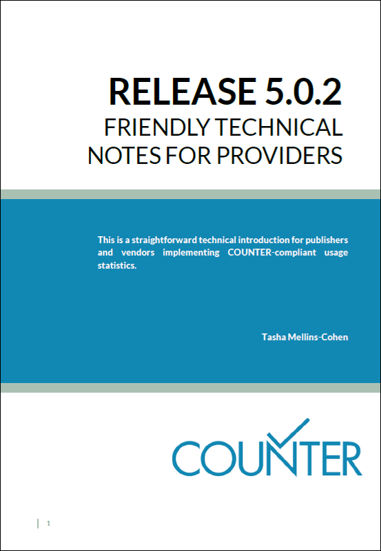

.. The COUNTER Code of Practice Release 5 © 2017-2021 by COUNTER
   is licensed under CC BY-SA 4.0. To view a copy of this license,
   visit https://creativecommons.org/licenses/by-sa/4.0/

|clearpage|

Appendix D: Guidelines for Implementation
=========================================

Note: The main Code of Practice document takes precedence in the case of any conflicts between it and this appendix.

Our `Friendly Technical Notes for Providers <https://www.projectcounter.org/wp-content/uploads/2021/09/Release5.0.2_FG_Tech_v3.pdf>`_ provides guidelines for implementation.

